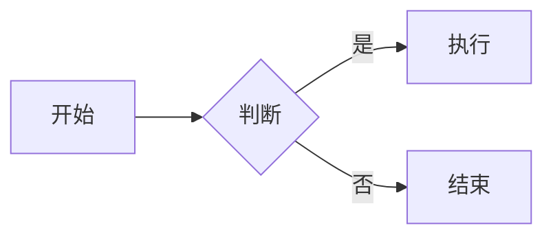

# 飞书同步脚本使用示例

## 基础用法

### 1. 同步单个文件

```bash
# 同步需求分析文档
node .claude/skills/feishu-sync/scripts/feishu-sync.js prd/需求分析/线索中心需求分析.md

# 同步PRD文档
node .claude/skills/feishu-sync/scripts/feishu-sync.js prd/PRD/线索中心PRD.md
```

### 2. 批量同步

```bash
# 同步整个需求分析目录
node .claude/skills/feishu-sync/scripts/feishu-sync.js --batch prd/需求分析/

# 同步PRD目录
node .claude/skills/feishu-sync/scripts/feishu-sync.js --batch prd/PRD/

# 同步测试目录
node .claude/skills/feishu-sync/scripts/feishu-sync.js --batch prd/test/
```

### 3. 删除文档

```bash
# 删除单个文档
node .claude/skills/feishu-sync/scripts/feishu-sync.js --delete doxcn_xxxxxxxxxx

# 批量删除（配合脚本）
for doc_id in doc1 doc2 doc3; do
  node .claude/skills/feishu-sync/scripts/feishu-sync.js --delete $doc_id
done
```

## 高级用法

### 1. 同步并复制链接

```bash
# macOS
node .claude/skills/feishu-sync/scripts/feishu-sync.js prd/test/飞书同步测试文档.md | grep "https://" | head -1 | pbcopy

# Linux
node .claude/skills/feishu-sync/scripts/feishu-sync.js prd/test/飞书同步测试文档.md | grep "https://" | head -1 | xclip -selection clipboard
```

### 2. 定时同步

```bash
# 每天上午 10 点同步
0 10 * * * cd /path/to/pm_agent && node .claude/skills/feishu-sync/scripts/feishu-sync.js prd/需求分析/最新需求.md
```

### 3. 同步后通知

```bash
#!/bin/bash
# sync-and-notify.sh

node .claude/skills/feishu-sync/scripts/feishu-sync.js prd/PRD/新功能PRD.md > /tmp/sync.log 2>&1

if [ $? -eq 0 ]; then
  # 发送通知（例如：飞书机器人、邮件等）
  URL=$(grep "https://" /tmp/sync.log | head -1)
  echo "✅ 同步成功：$URL" | tee /tmp/sync-result.txt
else
  echo "❌ 同步失败" | tee /tmp/sync-result.txt
fi
```

## Claude Code 技能调用示例

### 示例 1：同步最新的需求分析

```
用户：把最新的需求分析同步到飞书

AI：
1. 查找最新文件：ls -lt prd/需求分析/*.md | head -1
2. 提取文件名
3. 运行：node .claude/skills/feishu-sync/scripts/feishu-sync.js <文件>
4. 返回飞书链接给用户
```

### 示例 2：同步整个 PRD 目录

```
用户：把所有 PRD 文档同步到飞书

AI：
1. 运行：node .claude/skills/feishu-sync/scripts/feishu-sync.js --batch prd/PRD/
2. 等待完成
3. 返回成功/失败统计
```

### 示例 3：创建流程图画板

```
用户：把下面的流程图创建到飞书



AI：
1. 保存为 temp.md
2. 运行：node .claude/skills/feishu-sync/scripts/feishu-sync.js temp.md
3. 返回画板链接
4. 删除 temp.md
```

## 性能测试

### 测试不同大小的文档

```bash
# 小文档（100 Block）
time node .claude/skills/feishu-sync/scripts/feishu-sync.js prd/test/small.md

# 中文档（500 Block）
time node .claude/skills/feishu-sync/scripts/feishu-sync.js prd/需求分析/线索中心需求分析.md

# 大文档（1000+ Block）
time node .claude/skills/feishu-sync/scripts/feishu-sync.js prd/PRD/完整PRD.md
```

### 并发测试

```bash
# 顺序同步 3 个文件
time for f in prd/test/*.md; do
  node .claude/skills/feishu-sync/scripts/feishu-sync.js "$f"
done

# 注意：不建议并行运行多个同步脚本（会触发限流）
```

## 集成示例

### 1. 集成到 Git Hook

```bash
# .git/hooks/post-commit
#!/bin/bash

# 如果提交了 PRD 文件，自动同步到飞书
if git diff --name-only HEAD~1 | grep -q "prd/.*\.md$"; then
  echo "🚀 检测到 PRD 更新，同步到飞书..."
  git diff --name-only HEAD~1 | grep "prd/.*\.md$" | while read file; do
    node .claude/skills/feishu-sync/scripts/feishu-sync.js "$file"
  done
fi
```

### 2. 集成到 CI/CD

```yaml
# .github/workflows/sync-feishu.yml
name: Sync to Feishu

on:
  push:
    paths:
      - 'prd/**/*.md'

jobs:
  sync:
    runs-on: ubuntu-latest
    steps:
      - uses: actions/checkout@v2
      - name: Setup Node.js
        uses: actions/setup-node@v2
        with:
          node-version: '16'
      - name: Sync to Feishu
        env:
          FEISHU_APP_ID: ${{ secrets.FEISHU_APP_ID }}
          FEISHU_APP_SECRET: ${{ secrets.FEISHU_APP_SECRET }}
        run: |
          for file in prd/**/*.md; do
            node .claude/skills/feishu-sync/scripts/feishu-sync.js "$file"
          done
```

### 3. 集成到 VSCode Task

```json
// .vscode/tasks.json
{
  "version": "2.0.0",
  "tasks": [
    {
      "label": "Sync to Feishu",
      "type": "shell",
      "command": "node .claude/skills/feishu-sync/scripts/feishu-sync.js ${file}",
      "problemMatcher": [],
      "presentation": {
        "reveal": "always",
        "panel": "new"
      }
    }
  ]
}
```

## 故障排查

### 问题 1：认证失败

```bash
# 检查环境变量
echo $FEISHU_APP_ID
echo $FEISHU_APP_SECRET

# 验证格式
if [[ ! "$FEISHU_APP_ID" =~ ^cli_ ]]; then
  echo "App ID 格式错误，应以 cli_ 开头"
fi
```

### 问题 2：限流错误

```bash
# 增加延迟
SLEEP_MS=500 node .claude/skills/feishu-sync/scripts/feishu-sync.js file.md

# 或减少并发
PARALLEL_LIMIT=5 node .claude/skills/feishu-sync/scripts/feishu-sync.js file.md
```

### 问题 3：表格未转换

```bash
# 检查表格格式
cat file.md | grep "^\|" | head -5

# 确保有分隔行
# |---|---|
```

## 批处理脚本

### 批量同步并生成报告

```bash
#!/bin/bash
# batch-sync-report.sh

OUTPUT_FILE="sync-report-$(date +%Y%m%d-%H%M%S).md"

echo "# 飞书同步报告" > $OUTPUT_FILE
echo "生成时间：$(date '+%Y-%m-%d %H:%M:%S')" >> $OUTPUT_FILE
echo "" >> $OUTPUT_FILE

SUCCESS=0
FAILED=0

for file in prd/需求分析/*.md; do
  echo "## $(basename $file)" >> $OUTPUT_FILE
  echo "" >> $OUTPUT_FILE
  
  RESULT=$(node .claude/skills/feishu-sync/scripts/feishu-sync.js "$file" 2>&1)
  
  if echo "$RESULT" | grep -q "✅ 同步完成"; then
    URL=$(echo "$RESULT" | grep "https://" | head -1)
    echo "- 状态：✅ 成功" >> $OUTPUT_FILE
    echo "- 链接：$URL" >> $OUTPUT_FILE
    SUCCESS=$((SUCCESS + 1))
  else
    echo "- 状态：❌ 失败" >> $OUTPUT_FILE
    echo "- 错误：$(echo "$RESULT" | tail -5)" >> $OUTPUT_FILE
    FAILED=$((FAILED + 1))
  fi
  
  echo "" >> $OUTPUT_FILE
  echo "---" >> $OUTPUT_FILE
  echo "" >> $OUTPUT_FILE
  
  sleep 1
done

echo "# 统计" >> $OUTPUT_FILE
echo "- 成功：$SUCCESS" >> $OUTPUT_FILE
echo "- 失败：$FAILED" >> $OUTPUT_FILE
echo "- 总计：$((SUCCESS + FAILED))" >> $OUTPUT_FILE

cat $OUTPUT_FILE
```

## 快速测试

```bash
# 运行快速测试
bash .claude/skills/feishu-sync/scripts/test-sync.sh

# 或手动测试
node .claude/skills/feishu-sync/scripts/feishu-sync.js prd/test/飞书同步测试文档.md
```

## 参考文档

- [README.md](../README.md) - 快速指南
- [USAGE.md](../USAGE.md) - 详细使用文档
- [SKILL.md](../SKILL.md) - 技能说明
- [CHANGELOG.md](../CHANGELOG.md) - 更新日志
