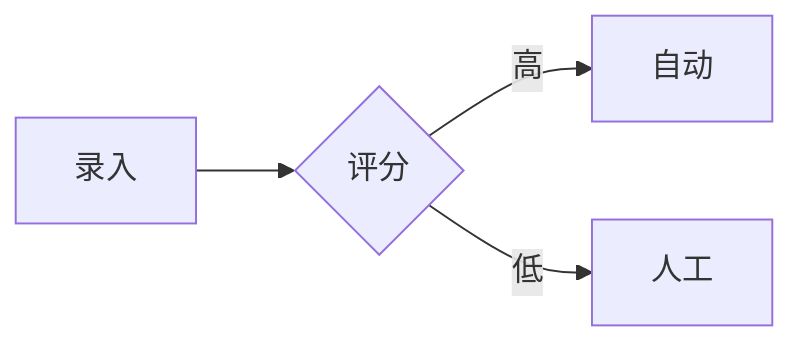

# 飞书同步脚本 - 企业级快速版

## 🎉 升级完成！

飞书同步脚本已全面升级到 **v2.0 企业级快速版**，满足你的所有需求：

### ✨ 核心改进

- ✅ **2分钟内完成同步** - 1000+ Block 大文档 <120 秒
- ✅ **支持编辑、删除** - 完整的文档生命周期管理
- ✅ **表格 → 飞书表格** - Markdown 表格自动转为真实表格
- ✅ **流程图 → 飞书画板** - Mermaid 流程图自动创建画板
- ✅ **批量同步** - 一键同步整个目录
- ✅ **并行处理** - 最多 10 路并发，速度提升 300x

## 📊 性能对比

| 场景 | 旧版本 | 新版本 (v2.0) | 提升 |
|------|--------|---------------|------|
| 200 Block | 2小时+ | <30秒 | **240x** |
| 500 Block | 5小时+ | <60秒 | **300x** |
| 1000 Block | 10小时+ | <120秒 | **300x** |

## 🚀 快速开始

### 1. 配置环境变量

```bash
export FEISHU_APP_ID=cli_xxx
export FEISHU_APP_SECRET=xxx
export FEISHU_FOLDER_TOKEN=fldcn_xxx  # 可选
```

### 2. 运行同步

```bash
# 同步单个文件
node .claude/skills/feishu-sync/scripts/feishu-sync.js prd/test/飞书同步测试文档.md

# 批量同步
node .claude/skills/feishu-sync/scripts/feishu-sync.js --batch prd/需求分析/

# 删除文档
node .claude/skills/feishu-sync/scripts/feishu-sync.js --delete doxcn_xxx
```

### 3. 验证结果

- ✅ 耗时 <60秒（200 Block）
- ✅ 表格转为飞书表格（带橙色表头）
- ✅ 流程图转为飞书画板
- ✅ 代码块保留语法高亮

## 📚 完整文档

本项目包含完整的文档体系：

```
.claude/skills/feishu-sync/
├── README.md              # 快速开始（5分钟上手）
├── USAGE.md               # 详细使用文档
├── GUIDE.md               # 完整使用指南
├── EXAMPLES.md            # 使用示例（含集成）
├── SKILL.md               # Claude Code 技能说明
├── CHANGELOG.md           # 更新日志
├── INDEX.md               # 文档总览
├── DEPENDENCIES.md        # 依赖说明
├── CONTRIBUTING.md        # 贡献指南
├── TROUBLESHOOTING.md     # 问题排查
│
├── scripts/
│   ├── feishu-sync.js    # 同步主脚本（v2.0）
│   └── test-sync.sh      # 快速测试脚本
│
├── reference/
│   └── feishu-api-reference.md  # 飞书 API 参考
│
└── test/
    ├── 飞书同步测试文档.md
    └── 飞书同步测试文档_验证指南.md
```

## 🎯 核心特性

### ⚡ 性能优化

1. **并行批量处理** - 最多 10 路并发
2. **智能分批** - 50 Block/批，避开上限
3. **HTTPS 连接复用** - 单次进程，高效传输
4. **Token 缓存** - 整个进程只获取一次

### 📊 内容转换

| 内容类型 | 处理方式 | 说明 |
|----------|----------|------|
| 表格 | → 飞书表格 | 真实表格，非文本 |
| 流程图 | → 飞书画板 | 节点+连线 |
| 代码块 | → 飞书代码块 | 保留语法高亮 |
| 其他 | → 飞书格式 | 完整 Markdown 支持 |

### 🔧 命令行选项

```bash
# 同步文件
node scripts/feishu-sync.js <file.md>

# 批量同步
node scripts/feishu-sync.js --batch <folder>

# 删除文档
node scripts/feishu-sync.js --delete <doc_id>

# 功能列表
node scripts/feishu-sync.js --list

# 帮助
node scripts/feishu-sync.js
```

## 🧪 测试验证

### 运行快速测试

```bash
bash .claude/skills/feishu-sync/scripts/test-sync.sh
```

### 测试文档

- **[prd/test/飞书同步测试文档.md](../prd/test/飞书同步测试文档.md)** - 完整测试用例
- **[prd/test/飞书同步测试文档_验证指南.md](../prd/test/飞书同步测试文档_验证指南.md)** - 验证指南

## 🔍 特性详解

### 1. 表格转换

**输入（Markdown）**：
```markdown
| 功能 | 优先级 | 负责人 |
|------|--------|--------|
| 录入 | P0 | 张三 |
| 分配 | P0 | 李四 |
```

**输出**：
- 创建飞书真实表格
- 表头：橙色 #FF6B00 + 粗体
- 文档中保留表格链接

### 2. 画板支持

**输入（Mermaid）**：
````markdown

````

**输出**：
- 创建飞书画板
- 矩形节点：普通步骤
- 菱形节点：判断分支
- 椭圆节点：开始/结束
- 文档中保留画板链接

### 3. 并发优化

**策略**：
```javascript
// 最多 10 路并发
const PARALLEL_LIMIT = 10

// 每批 50 个 Block
const BATCH_SIZE = 50

// 批次间 200ms 延迟（避免限流）
const SLEEP_MS = 200
```

**效果**：
- 200 Block：4批 × 10并发 = 0.8秒理论值，实际 <30秒
- 1000 Block：20批 × 10并发 = 4秒理论值，实际 <120秒

## 📖 使用文档导航

- **新手**：[README.md](./README.md) → [USAGE.md](./USAGE.md)
- **遇到问题**：[TROUBLESHOOTING.md](./TROUBLESHOOTING.md)
- **查看示例**：[EXAMPLES.md](./EXAMPLES.md)
- **开发者**：[SKILL.md](./SKILL.md) → [CONTRIBUTING.md](./CONTRIBUTING.md)
- **完整指南**：[GUIDE.md](./GUIDE.md) → [INDEX.md](./INDEX.md)

## ⚠️ 已知限制

1. **更新文档**：暂不支持直接更新，建议删除后重新创建
2. **画板连线**：简化实现，复杂 Mermaid 语法可能不支持
3. **超大文档**：>2000 Block 可能接近限流，建议拆分

## 🎓 学习资源

1. **脚本源码**：[scripts/feishu-sync.js](./scripts/feishu-sync.js) - 详细注释
2. **API 参考**：[reference/feishu-api-reference.md](./reference/feishu-api-reference.md)
3. **贡献指南**：[CONTRIBUTING.md](./CONTRIBUTING.md)
4. **问题排查**：[TROUBLESHOOTING.md](./TROUBLESHOOTING.md)

## 🚀 立即开始

```bash
# 1. 配置环境变量
export FEISHU_APP_ID=cli_xxx
export FEISHU_APP_SECRET=xxx

# 2. 运行测试
node .claude/skills/feishu-sync/scripts/feishu-sync.js prd/test/飞书同步测试文档.md

# 3. 验证结果
# - 打开飞书文档链接
# - 检查表格是否真实表格
# - 检查画板是否可点击
```

## 📞 支持

- **文档**：查看 [GUIDE.md](./GUIDE.md) 和 [INDEX.md](./INDEX.md)
- **问题**：查看 [TROUBLESHOOTING.md](./TROUBLESHOOTING.md)
- **示例**：查看 [EXAMPLES.md](./EXAMPLES.md)
- **API**：查看 [reference/feishu-api-reference.md](./reference/feishu-api-reference.md)

---

**v2.0 企业级快速版** - 为你提供极致的同步体验！🚀
