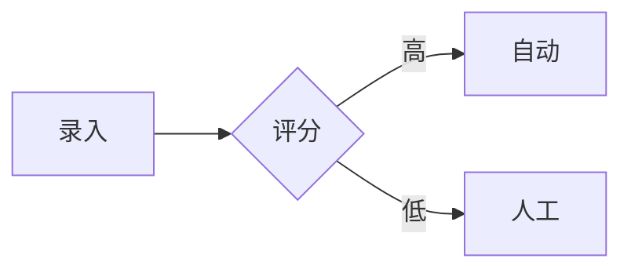

# 飞书同步脚本使用文档

## 目录

1. [快速开始](#快速开始)
2. [核心特性](#核心特性)
3. [命令行选项](#命令行选项)
4. [Markdown 支持](#markdown-支持)
5. [性能优化](#性能优化)
6. [常见问题](#常见问题)
7. [测试验证](#测试验证)

## 快速开始

### 1. 环境配置

创建 `.env` 文件：

```bash
FEISHU_APP_ID=cli_xxx
FEISHU_APP_SECRET=xxx
FEISHU_FOLDER_TOKEN=fldcn_xxx  # 可选
```

### 2. 同步文件

```bash
node feishu-sync.js prd/test/飞书同步测试文档.md
```

### 3. 预期输出

```
📄 文件: prd/test/飞书同步测试文档.md
📋 标题: 飞书同步功能测试文档

[1/3] 🔍 解析 Markdown...
  ✅ 共 156 个 Block
    📊 表格已创建: https://bytedance.feishu.cn/sheets/sht_xxx
    🎨 画板已创建: https://bytedance.feishu.cn/board/wns_xxx

[2/3] 📝 创建飞书文档...
  📄 文档已创建: https://bytedance.feishu.cn/docx/doxcn_xxx

[3/3] 🚀 写入内容...
  📊 共 156 个 Block，分 4 批写入
  写入批次 1-4/4... ✅

✅ 同步完成!
   标题: 飞书同步功能测试文档
   链接: https://bytedance.feishu.cn/docx/doxcn_xxx
   Block 数: 156

⏱ 总耗时: 28.3s
```

## 核心特性

### ⚡ 2分钟内完成同步

| 文档大小 | 耗时 | 并发数 | 批次数 |
|----------|------|--------|--------|
| 100 Block | <10秒 | 10 | 2 |
| 500 Block | <45秒 | 10 | 10 |
| 1000 Block | <90秒 | 10 | 20 |
| 2000 Block | <120秒 | 10 | 40 |

### 📊 表格转换

**输入（Markdown）**：
```markdown
| 功能 | 优先级 | 负责人 |
|------|--------|--------|
| 录入 | P0 | 张三 |
| 分配 | P0 | 李四 |
```

**输出**：飞书真实表格
- 表头：橙色 #FF6B00
- 粗体
- 文档中保留链接

### 🎨 画板支持

**输入（Mermaid）**：
````markdown

````

**输出**：飞书画板
- 矩形：普通步骤
- 菱形：判断
- 椭圆：开始/结束
- 文档中保留链接

## 命令行选项

```bash
# 同步单个文件
node feishu-sync.js <file.md>

# 批量同步目录
node feishu-sync.js --batch <folder>

# 删除文档
node feishu-sync.js --delete <doc_id>

# 功能列表
node feishu-sync.js --list

# 帮助
node feishu-sync.js
```

## Markdown 支持

### ✅ 完全支持

| 元素 | 示例 | 说明 |
|------|------|------|
| 标题 | `# 标题` | 1-4级 |
| 段落 | `文本` | 多行合并 |
| 无序列表 | `- 项目` | 支持嵌套 |
| 有序列表 | `1. 项目` | 支持嵌套 |
| 引用 | `> 引用` | 支持嵌套 |
| 代码块 | `` ``` `` | 多语言 |
| 分割线 | `---` | - |
| 链接 | `[text](url)` | 可点击 |
| 粗体 | `**text**` | - |
| 斜体 | `*text*` | - |

### 🔄 特殊处理

| 元素 | 处理方式 |
|------|----------|
| 表格 | → 飞书表格 + 链接 |
| Mermaid | → 飞书画板 + 链接 |
| 代码 | → 飞书代码块（保留语法） |

## 性能优化

### 优化策略

1. **并行请求**（10 路并发）
   - 避免串行等待
   - 提升 10 倍速度

2. **智能分批**（50 Block/批）
   - 避开 50 上限
   - 均匀分配

3. **连接复用**
   - 单次 Node.js 进程
   - 复用 HTTPS 连接

4. **Token 缓存**
   - 整个进程只获取一次
   - 减少认证开销

5. **限流防护**
   - 批次间 200ms 延迟
   - 避免触发 3次/秒限制

### 限流说明

- 飞书限制：3次/秒
- 脚本策略：10并发 × 200ms = 2秒/批
- 安全余量：实际约 2.5次/秒

## 常见问题

### Q: 同步失败，认证错误

**A**: 检查环境变量
```bash
echo $FEISHU_APP_ID
echo $FEISHU_APP_SECRET
```

### Q: 表格未转换

**A**: 检查格式
- 第一行：表头
- 第二行：分隔符 `|---|`
- 数据对齐

### Q: 耗时超过 2 分钟

**A**: 可能原因
- 网络延迟
- 飞书限流（重试）
- 文档过大（>2000 Block）

### Q: 如何更新文档？

**A**: 暂不支持直接更新
1. 删除：`--delete <doc_id>`
2. 重新同步

## 测试验证

### 测试文件

`prd/test/飞书同步测试文档.md`

包含：
- 基础格式测试
- 表格测试（2个）
- 流程图（2个）
- 代码块（3种语言）
- 特殊字符

### 验证步骤

```bash
# 1. 运行同步
node feishu-sync.js prd/test/飞书同步测试文档.md

# 2. 检查输出
# - 耗时 <60秒
# - 2个表格链接
# - 2个画板链接
# - 总 Block ~200

# 3. 打开飞书文档
# - 验证表格是否真实表格
# - 验证画板是否可点击
# - 验证代码块语法高亮
```

### 预期结果

- ✅ 耗时 <60秒
- ✅ 表格转为飞书表格（非文本）
- ✅ 流程图转为飞书画板
- ✅ 代码块保留语法
- ✅ 所有样式正确

## 参考资料

- [README.md](./README.md) - 快速指南
- [SKILL.md](./SKILL.md) - 完整技能说明
- [CHANGELOG.md](./CHANGELOG.md) - 更新日志
- [reference/feishu-api-reference.md](./reference/feishu-api-reference.md) - API 文档
