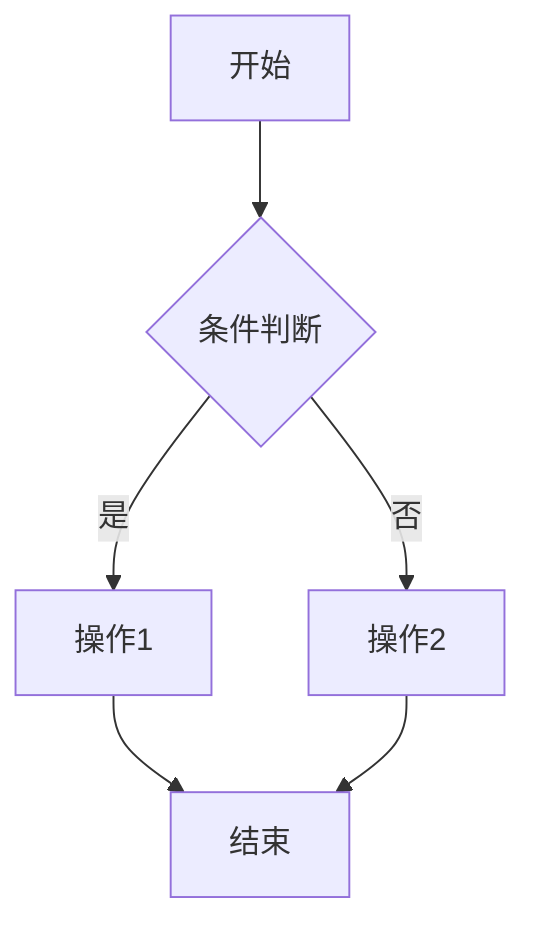

# PRD 模板（AI 产品经理专用）

> **版本历史**

| 版本 | 日期 | 修改人 | 变更说明 |
|------|------|--------|----------|
| v1.0 |      |        | 初稿     |

---

## 一、项目背景与目标

### 1.1 需求背景

- **当前痛点**：描述没有 AI 之前，业务流程中的具体瓶颈。例如：客服处理工单耗时过长，知识库搜索结果不匹配等。
- **为何引入 AI**：解释为什么规则引擎或传统软件无法解决此问题，必须使用 LLM（大语言模型）。

### 1.2 需求目标

- **量化目标**：明确可衡量的业务指标。例如：工单处理时长从 15min 降至 5min、解决率提升至 80%、节省 2 FTE（全职人力）。
- **项目范围**：
  - **MVP 范围（Phase 1）**：本期必须交付的核心功能。
  - **未来规划（Phase 2+）**：后续迭代方向，本期不纳入。

---

## 二、用户场景与交互流程

### 2.1 用户故事

- **角色**：例如：销售代表、法务专员
- **场景**：例如：在 CRM 系统中，需要快速根据客户对话生成跟进邮件。
- **期望结果**：邮件内容准确包含客户需求，语气专业，无需大幅修改即可发送。

### 2.2 业务流程图

使用 Mermaid 语法绘制完整的业务流程图。标注 AI 在业务流中的切入点（Copilot 辅助驾驶模式 or Agent 自主智能体模式）。

### 2.3 人在环 (HITL) 设计

- **触发条件**：例如：当模型置信度低于 0.7 时，转人工审核。
- **人工介入方式**：用户编辑、确认、驳回。
- **反馈闭环**：
  - **用户反馈收集**：AI 输出结果的"点赞/点踩/修改"数据如何回流，用于模型持续优化。
  - **Bad Case 沉淀**：用户驳回或大幅修改的结果自动归档，定期进入黄金数据集。

---

## 三、AI 核心任务定义

> **核心差异点**：传统 PRD 写功能逻辑 (If-Then)，AI PRD 写任务定义 (Input-Output)。

### 3.1 任务描述

- **任务类型**：例如：信息抽取 (Extraction)、内容生成 (Generation)、意图识别 (Classification)、RAG 问答
- **输入字段定义**：**使用表格逐项列出输入字段、类型、说明**，不得只写"某段文本"或"某个 JSON"。例如：

  | 字段 | 类型 | 说明 |
  |------|------|------|
  | salesperson_id | string | 销售人员 ID |
  | time_range | string | 统计时间范围，格式 `YYYY-MM-DD ~ YYYY-MM-DD` |
  | follow_up_records | array | 跟进记录列表，每条包含 date、customer_name、content 等字段 |
  | performance_data | object | 业绩数据，包含 monthly_target、monthly_actual 等字段 |

- **输出字段定义**：**使用表格逐项列出输出字段、类型、说明**，不得只写"返回结构化数据"。例如：

  | 字段 | 类型 | 说明 |
  |------|------|------|
  | overall_score | number | 综合评分，0-100 分 |
  | dimensions | object | 各维度评分，每个维度包含 score（数值）和 summary（字符串摘要） |
  | strengths | array\<string\> | 优势标签列表 |
  | weaknesses | array\<string\> | 待改进标签列表 |
  | recommendations | array\<string\> | 改进建议列表 |
- **输入 (Input)**：描述输入数据的来源和整体结构。例如：一段 500 字以内的会议录音转写文本 + 客户历史画像 JSON。
- **输出 (Output)**：描述输出数据的整体格式和用途。例如：一段 JSON 格式的结构化数据，用于前端渲染为画像卡片。

### 3.2 模型选型与配置

- **基座模型**：例如：GPT-4o（处理复杂推理）、Llama-3-70B（私有化部署）、Qwen-Turbo（高性价比）。
- **参数配置**：
  - Temperature（随机性）：例如：0.2（严谨任务）/ 0.8（创意任务）
  - Top P：例如：0.9
  - Context Window（上下文窗口限制）：例如：128k，需注意长文本截断策略。

### 3.3 提示词策略

在此处提供经过验证的 Prompt 结构，供研发参考。

- **System Prompt（角色设定）**：你是资深的 B2B 销售专家，语气专业、诚恳。请基于提供的上下文回答...
- **Few-Shot Examples（少样本示例）**：
  - 输入示例：客户说"太贵了"。
  - 输出示例：表示理解，并强调产品的长期 ROI 价值...
- **CoT（思维链）要求**：请按步骤思考：1. 分析客户意图；2. 检索相关知识库；3. 生成回复。

### 3.4 知识库与 RAG 策略（仅针对知识密集型任务）

- **数据源**：例如：企业产品手册 PDF、历史工单数据 CSV。
- **切片策略 (Chunking)**：例如：按语义切分，每段 500 tokens，重叠 10%。
- **检索策略**：例如：混合检索（关键词 + 向量），重排序 (Rerank) Top 5。

---

## 四、功能需求

### 4.1 输入端

- **格式限制**：支持的文件类型、字数限制。
- **预处理**：敏感信息 (PII) 过滤规则。

### 4.2 输出端与交互

- **流式输出 (Streaming)**：是否需要打字机效果？
- **结构化展示**：AI 输出的 JSON 如何渲染为表格/卡片？
- **引用溯源**：RAG 场景下，必须在答案中标注引用来源（页码/链接），点击可跳转原文。

### 4.3 异常处理与兜底

- **拒答机制**：当用户问题超出业务范围或涉及违规时，AI 应回复的标准话术。
- **幻觉抑制**：若检索结果为空，严禁 AI 编造，应回复"未找到相关信息"。
- **超时处理**：推理时间超过 X 秒时的 UI 表现。

---

## 五、评测与验收标准

> 这是 AI 项目能否上线的生死线，必须量化。

### 5.1 黄金数据集

- **构建方式**：由业务专家人工编写的 50-100 条标准问答对 (Ground Truth)。
- **覆盖范围**：需包含 70% 常见场景 + 30% 极端场景 (Corner Cases)。

### 5.2 验收指标

- **自动化评测 (LLM-as-a-Judge)**：
  - 准确性：例如：> 90%
  - 相关性：例如：> 95%
- **人工评测**：
  - 可用性：业务专家抽检通过率 > 85%
  - 幻觉率：< 5%
- **性能指标**：
  - 首字延迟 (TTFT)：< 1.5s
  - 全量生成时间：< 10s（针对长文）

### 5.3 上线后监控

- **日常指标**：每日调用量、失败率、用户满意度（点赞/点踩比）趋势。
- **Bad Case 巡检**：频率（如每周）、负责人、从发现到修复的 SLA。
- **告警机制**：当幻觉率或失败率超过阈值时，自动告警并触发人工介入。

---

## 六、数据安全与合规

- **数据隐私**：是否私有化部署？数据是否出境？PII 如何脱敏？
- **内容安全**：输入/输出关键词过滤机制。
- **算法备案**：是否涉及生成式 AI 服务管理办法的备案要求？

---

## 七、附录（可选）

> 初版 PRD 可省略此部分，有实际内容时再补充。

- [版本历史]
- [项目里程碑与排期]
- [Prompt 调试日志]
- [Bad Case 记录]
- [成本计算]
