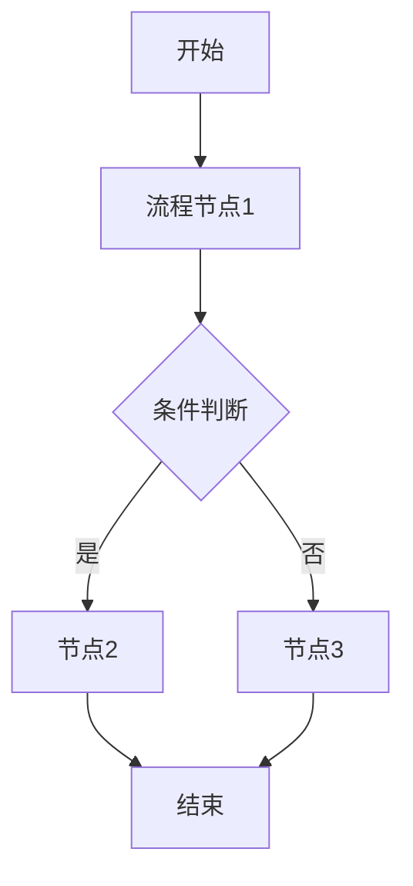
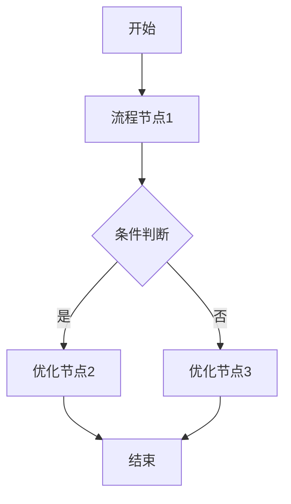

# 需求分析模板

## 一、需求背景分析

描述需求的来源、现状问题或机会。明确为什么要做这个需求。

**分析要点**：
- 当前业务痛点是什么？
- 受影响的用户/角色有哪些？
- 不做这个需求会有什么影响？

---

## 二、需求目标确认

基于需求背景，确认本次需求的核心目标和期望成果。

**目标特征**：
- 具体可衡量
- 有明确的价值交付
- 可落地执行

---

## 三、业务流程分析

使用 Mermaid 语法绘制当前业务流程（现状）和目标流程（改善后）。

### 3.1 当前流程（现状）

### 3.2 目标流程（改善后）

---

## 四、功能拆解清单

按结构化表格表达：

| 终端 | 模块 | 功能 | 功能描述 | 优先级 |
|------|------|------|----------|----------|
| 门店APP | 首页 | banner轮播 | 展示促销活动 Banner，支持点击跳转 | Must |
| 门店APP | 我的 | 订单查询 | 支持按状态筛选订单列表 | Should |
| 门店后端 | 订单服务 | 数据同步 | 订单数据实时同步至供应链中台 | Must |

**格式要求**：
- 终端：门店APP / 门店PC / 供应链中台 / 客户小程序 / 门店后端 / 供应链中台后端 / 客户小程序后端
- 模块：所属功能模块
- 功能：前端按页面/弹窗拆分；后端按服务/能力拆分
- 功能描述：简要描述该功能的需求要点
- 优先级：Must（必须有）/ Should（应该有）/ Could（可以有）/ Won't（不会有）

**系统现状参考**：如需了解现有系统功能，参见 `reference/system-status.md`

---

## 五、待确认事项

列出需求中尚未确认、需要与干系人进一步沟通的内容。

| 序号 | 待确认事项 | 状态 | 负责人 | 截止日期 |
|------|------------|------|--------|----------|
| 1 | XX 功能的具体规则 | 待确认 | - | - |
| 2 | 第三方接口的响应格式 | 待确认 | - | - |

**确认原则**：
- 所有 Must 级别功能必须在 PRD 撰写前完成确认
- 未确认事项不得在 PRD 中编造，必须标注"待确认"
