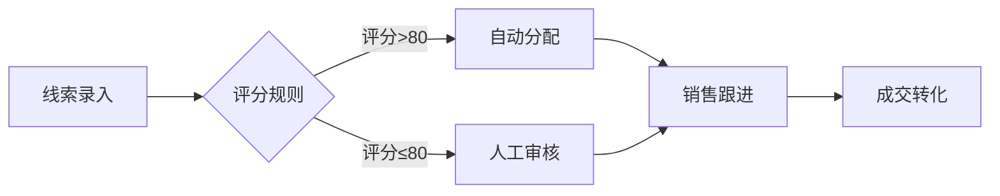
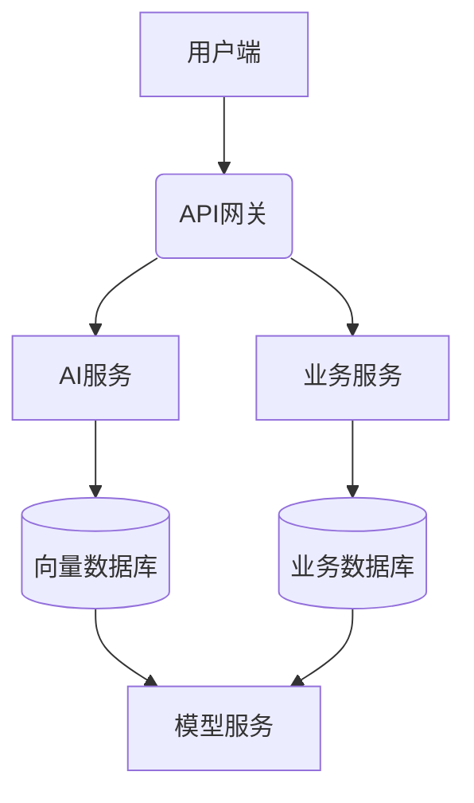

# 飞书同步功能测试文档

## 一、基本文本格式

### 1.1 标题测试

# 一级标题
## 二级标题
### 三级标题
#### 四级标题（转为三级）

### 1.2 段落测试

这是第一段文字，包含多行内容。
第二行继续第一段。

这是第二段，与第一段之间有空行分隔。

### 1.3 强调和样式

**粗体文字** 测试
*斜体文字* 测试
~~删除线~~ 测试
`行内代码` 测试
[超链接测试](https://www.feishu.cn)

## 二、列表测试

### 2.1 无序列表

- 项目一
- 项目二
  - 子项目 2.1
  - 子项目 2.2
- 项目三

### 2.2 有序列表

1. 第一项
2. 第二项
   1. 子项 2.1
   2. 子项 2.2
3. 第三项

### 2.3 混合列表

- 无序项目
  1. 有序子项目
  2. 有序子项目
- 无序项目

## 三、引用和分隔线

### 3.1 引用块

> 这是一个引用块
> 第二行引用
> 
> > 嵌套引用

### 3.2 分隔线

---

## 四、代码块

### 4.1 JavaScript

```javascript
function helloWorld() {
  console.log('Hello, World!');
  return true;
}
```

### 4.2 Python

```python
def hello_world():
    print("Hello, World!")
    return True
```

### 4.3 Shell

```bash
#!/bin/bash
echo "Hello, World!"
ls -la
```

## 五、表格测试

### 5.1 功能清单表

| 功能模块 | 优先级 | 负责人 | 状态 |
|----------|--------|--------|------|
| 线索录入 | P0 | 张三 | 进行中 |
| 线索分配 | P0 | 李四 | 已完成 |
| 线索评分 | P1 | 王五 | 待开始 |
| 数据看板 | P1 | 赵六 | 进行中 |

### 5.2 评测指标表

| 指标项 | 目标值 | 当前值 | 差距 |
|--------|--------|--------|------|
| 准确率 | 95% | 89% | -6% |
| 响应时间 | <100ms | 85ms | ✅ |
| 并发能力 | 1000 QPS | 1200 QPS | ✅ |

## 六、流程图（Mermaid）

### 6.1 业务流程图



### 6.2 系统架构图



## 七、复杂内容

### 7.1 嵌套内容

这是一个包含**粗体**、`代码`和[链接](https://www.example.com)的段落。

- 列表项包含**强调**
- 代码块：
  ```python
  print("Hello")
  ```

### 7.2 大段文本

Lorem ipsum dolor sit amet, consectetur adipiscing elit. Nullam in dui mauris. Vivamus hendrerit arcu sed erat molestie vehicula. Sed auctor neque eu tellus rhoncus ut eleifend nibh porttitor. Ut in nulla enim. Phasellus molestie magna non est bibendum non venenatis nisl tempor. Suspendisse dictum feugiat nisl ut dapibus. Mauris iaculis porttitor posuere. Praesent id metus massa, ut blandit odio. Phasellus ullamcorper ipsum rutrum nunc. 

## 八、特殊字符

- Emoji: 👍 🎉 🚀 ✅ ❌
- 数学符号: α β γ δ ε
- 特殊字符: @ # $ % ^ & * ( ) _ + { } | : " < > ?

## 九、混合测试

### 9.1 文本 + 表格 + 代码

这是一个混合段落，包含表格引用：

| 步骤 | 操作 | 预期结果 |
|------|------|----------|
| 1 | 点击按钮 | 弹窗出现 |
| 2 | 输入数据 | 数据高亮 |
| 3 | 提交 | 成功提示 |

以及代码示例：

```javascript
// 处理函数
function handleData(data) {
  return data.map(item => ({
    ...item,
    processed: true
  }));
}
```

### 9.2 完整流程

1. 用户登录系统
2. 查看数据看板
   - 关键指标
   - 趋势图表
3. 执行操作
   - 新建记录
   - 编辑记录
   - 删除记录
4. 确认结果
