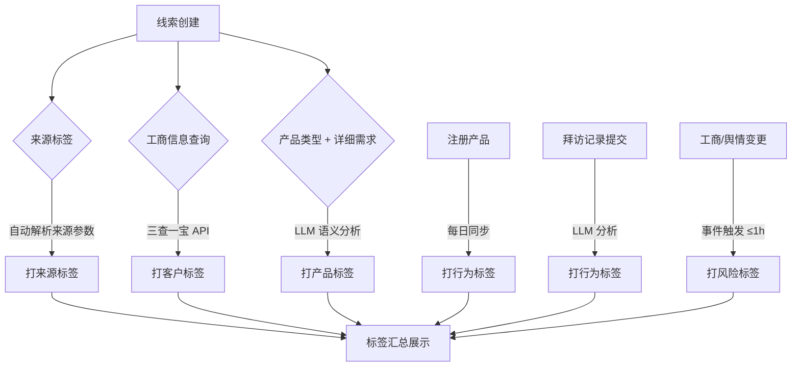

# PRD — 线索标签体系

> **版本历史**

| 版本 | 日期 | 修改人 | 变更说明 |
|------|------|--------|----------|
| v1.0 | 2026-06-24 | 刘君 | 初稿 — 从线索评分与分层系统PRD拆分，聚焦标签体系定义 |

---

## 一、项目背景与目标

### 1.1 需求背景

- **当前痛点**：
  1. **客户信息碎片化**：客户的基础信息、交易数据、服务记录、产品使用情况分散在不同系统中，缺乏统一的客户标签体系来整合这些维度，销售无法快速获得完整的客户信息。
  2. **线索质量难以量化判断**：当前 CRM 系统中已有丰富的客户数据标签（来源、客户、产品、行为、风险），但尚未形成量化的评价体系。
  3. **客户流失预警缺失**：无法提前识别有流失风险的客户，错失挽回窗口。

- **为何引入 AI**：
  - 拜访记录、招投标信息、详细需求等文本数据需要语义理解才能提取结构化标签，传统关键词匹配误判率高。
  - LLM 可在拜访记录分析、招投标分析、需求语义匹配等场景下提供高置信度的标签抽取。

### 1.2 需求目标

| # | 目标 | 量化指标 |
|---|------|----------|
| 1 | 构建五类标签体系 | 来源、客户、产品、行为、风险全覆盖 |
| 2 | 标签自动打标覆盖率 | 来源标签 100%、产品标签 > 90%、行为标签 > 80% |
| 3 | 高转化画像识别 | 物流/商贸高价值线索标签自动打标准确率 > 85% |

- **项目范围**：
  - **MVP 范围（Phase 1）**：标签自动打标引擎、五类标签定义、高转化画像匹配
  - **未来规划（Phase 2+）**：标签权重配置后台、标签趋势分析、竞品分析增强

---

## 二、用户场景与交互流程

### 2.1 用户故事

| 角色 | 场景 | 期望结果 |
|------|------|----------|
| 销售代表 | 查看线索详情 | 快速了解客户全貌（来源、工商信息、产品意向、行为轨迹、风险状态） |
| 运营人员 | 配置标签规则 | 可在后台调整标签命中规则，无需研发介入 |
| 系统 | 每日定时扫描工商数据 | 自动更新客户标签、触发风险预警 |

### 2.2 标签打标流程图



### 2.3 人在环 (HITL) 设计

- **触发条件**：
  - LLM 标签抽取置信度 < 0.7 时，标记为「待确认」，需销售人工核实
- **人工介入方式**：
  - 销售可手动补充拜访记录中的关键信息（预算金额、决策人等）
- **反馈闭环**：
  - 用户"点踩"的线索自动进入 Bad Case 管理池
  - 每周运营人员从 Bad Case 中抽取样本，更新黄金数据集

---

## 三、AI 核心任务定义

### 3.1 任务一：拜访记录标签抽取

- **任务类型**：信息抽取 (Extraction) + 分类 (Classification)
- **输入字段定义**：

| 字段 | 类型 | 来源 | 说明 |
|------|------|------|------|
| visit_record | string | CRM 拜访记录 | 销售提交的拜访文本内容 |
| customer_name | string | CRM 客户信息 | 客户企业名称 |
| salesperson_name | string | CRM 销售人员 | 拜访执行人 |
| visit_date | string | CRM 拜访记录 | 拜访日期，格式 YYYY-MM-DD |
| tag_library | object | 标签配置表 | 预设标签库 JSON（按意向度/态度/竞品/异议/动作/决策人/预算/紧急度分组） |

- **输出字段定义**：

| 字段 | 类型 | 说明 |
|------|------|------|
| intent_level | string | 意向等级：高意向 / 观望中 / 低意向 / 流失风险 |
| customer_attitude | string | 客户态度：积极 / 中性 / 消极 / 强烈不满 |
| competitor_mentioned | array\<string\> | 提及的竞品名称列表 |
| objection_type | array\<string\> | 异议类型：价格敏感 / 功能异议 / 实施异议 / 服务异议 / 决策异议 |
| next_action | string | 下一步动作：已约下次拜访 / 等客户反馈 / 需销售输出 / 待跟进 |
| decision_maker_reached | boolean | 是否接触决策人 |
| budget_status | string | 预算状态：预算充足 / 预算不足 |
| urgency | string | 紧急程度：紧急 / 近期（1-3个月） / 长期（>3个月） |
| confidence | number | 整体置信度，0-1 |
| reason | string | 分析理由，3 句话以内 |

- **输入 (Input)**：一段销售拜访记录文本（500-3000 字） + 客户企业名称 + 预设标签库
- **输出 (Output)**：JSON 格式结构化标签数据，用于行为标签打标

### 3.2 任务二：招投标信息分析

- **任务类型**：信息抽取 (Extraction) + 分析 (Analysis)
- **输入字段定义**：

| 字段 | 类型 | 来源 | 说明 |
|------|------|------|------|
| company_name | string | 三查一宝 API | 企业全称 |
| bidding_records | array | 招投标数据源 | 历史招投标记录列表，每条包含项目名称、时间、金额、内容摘要 |
| tag_library | object | 标签配置表 | 预设标签库 JSON |

- **输出字段定义**：

| 字段 | 类型 | 说明 |
|------|------|------|
| industry_tags | array\<string\> | 行业标签 |
| business_tags | array\<string\> | 主营业务标签 |
| project_tags | array\<string\> | 项目建设标签 |
| demand_tags | array\<string\> | 采购需求标签 |
| opportunity_tags | array\<string\> | 商机标签 |
| digital_level | string | 数字化成熟度 |
| procurement_level | string | 采购能力 |
| activity_level | string | 招投标活跃度 |
| customer_level | string | 客户价值等级 |
| core_tags | array\<string\> | 核心标签 |
| analysis_reason | string | 分析依据 |

- **输入 (Input)**：企业近 3 年招投标记录列表
- **输出 (Output)**：JSON 格式企业画像标签，用于客户标签打标

### 3.3 任务三：详细需求语义匹配

- **任务类型**：分类 (Classification)
- **输入字段定义**：

| 字段 | 类型 | 来源 | 说明 |
|------|------|------|------|
| company_name | string | CRM 客户信息 | 客户企业名称 |
| product_type | string | CRM 线索创建 | 当前选择的产品类型 |
| detail_requirement | string | CRM 线索创建 | 详细需求描述文本 |
| tag_library | object | 标签配置表 | 标准需求标签库（物流类/仓储类/金融类/交易类/能源类/保险类/数字化类/营销类） |

- **输出字段定义**：

| 字段 | 类型 | 说明 |
|------|------|------|
| demand_tags | array\<string\> | 匹配的需求标签，1-3 个，必须来自标签库 |

- **输入 (Input)**：客户公司名称 + 产品类型 + 详细需求文本
- **输出 (Output)**：JSON 数组格式需求标签

### 3.4 模型选型与配置

| 场景 | 推荐模型 | 理由 |
|------|----------|------|
| 拜访记录标签抽取 | 通义千问 Max / GPT-4o | 需要强语义理解能力，抽取 8 类标签 |
| 招投标信息分析 | 通义千问 Max / GPT-4o | 长文本分析，多维度推理 |
| 详细需求语义匹配 | 通义千问 Plus / GPT-4o-mini | 分类任务，成本敏感 |

- **参数配置**：
  - Temperature：0.1（信息抽取任务，要求确定性）
  - Top P：0.9
  - Context Window：32k（拜访记录 + 标签库不超过 8k tokens）

### 3.5 提示词策略

#### 拜访记录分析 — System Prompt

```
你是一名销售拜访记录分析专家。请根据销售拜访记录内容，识别客户业务场景、
需求状态、合作意向和项目阶段。

要求：
1. 仅从标签库中选择标签，不允许创造新标签
2. 输出 1-5 个最相关标签
3. 根据语义理解判断，不依赖关键词匹配
4. 支持识别隐含需求
5. 返回标签及置信度

输入：
- 拜访记录：{{visit_record}}
- 客户名称：{{customer_name}}
- 标签库：{{tag_library}}

输出格式（严格 JSON）：
{
  "intent_level": "高意向|观望中|低意向|流失风险",
  "customer_attitude": "积极|中性|消极|强烈不满",
  "competitor_mentioned": ["竞品A"],
  "objection_type": ["价格敏感"],
  "next_action": "已约下次拜访|等客户反馈|需销售输出|待跟进",
  "decision_maker_reached": true,
  "budget_status": "预算充足|预算不足",
  "urgency": "紧急|近期|长期",
  "confidence": 0.95,
  "reason": "简要分析原因"
}
```

#### 招投标分析 — System Prompt

```
你是一名企业招投标信息分析专家。根据企业历史招投标记录，分析企业所属
行业、主营业务、采购需求、项目建设方向、数字化水平、客户价值及潜在商机，
并生成标准化标签。

分析原则：
- 仅依据招投标事实进行分析
- 优先分析近 3 年数据
- 同类项目出现 2 次及以上视为长期需求
- 同类项目出现 3 次及以上视为重点需求
- 若证据不足，明确说明"暂无充分证据支持"
- 禁止主观猜测

输入：
- 企业名称：{{company_name}}
- 历史招投标记录：{{bidding_records}}
```

#### 详细需求语义匹配 — System Prompt

```
你是一名产品需求分析专家。请根据客户公司名称、当前产品类型和详细需求，
识别客户最核心的业务需求，并匹配标准需求标签。

规则：
- 基于需求语义进行判断，不依赖关键词匹配
- 标签必须从标签库中选择，不允许新增标签
- 输出 1-3 个最相关标签
- 优先识别客户真实业务场景和实际诉求
- 当前产品类型仅作为辅助信息，不作为判断依据
- 无法判断时返回空数组

标签库：
- 物流类：找车、找货、整车运输、零担运输、网络货运、运力调度、仓储配送、多式联运
- 仓储类：云仓、仓储管理、智能仓储、监管仓、仓单质押、库存管理
- 金融类：供应链融资、流动资金贷款、票据贴现、保理融资、授信融资、仓储融资
- 交易类：商贸撮合、平台交易、采购需求、销售渠道、供应链协同
- 能源类：油品采购、车队加油、能源供应链
- 保险类：货运保险、车辆保险、金融保险
- 数字化类：智慧场站、数字化转型、AI应用、数据资产
- 营销类：品牌推广、广告投放、联合营销、招商推广

输入：
- 公司名称：{{company_name}}
- 当前产品类型：{{product_type}}
- 详细需求：{{detail_requirement}}

输出格式（严格 JSON）：
{"需求标签": ["标签1", "标签2"]}
```

---

## 四、标签体系

### 4.1 标签总览

| 标签类型 | 数据来源 | 触发时机 | 更新频率 |
|----------|----------|----------|----------|
| 来源标签 | CRM 系统 | 线索创建时 | 创建时一次，不重复更新 |
| 客户标签 | 三查一宝（工商数据 API） | 新客户录入 / 工商变更 | 事件触发 + 每日全量 |
| 产品标签 | CRM 系统 — 产品类型 + 详细需求 | 线索创建 | 创建时打标，信息修改时重新匹配 |
| 行为标签 | 产品注册 / 拜访记录 / 画像标签平台 | 注册事件 / 拜访提交 / 每日同步 | 事件触发 / 每日 |
| 风险标签 | 工商 + 舆情 + 回款数据 | 异常事件 | 事件触发 ≤ 1h |

### 4.2 来源标签

| 命中规则 | 标签名称 | 更新规则 |
|----------|----------|----------|
| 线索根据进入渠道（自拓、自访、渠道推介、商贸、各业务系统）自动打标 | 来源-XX 渠道 | 创建时一次，不重复更新 |

- 一个线索只允许有一个来源标签（首次进入渠道为准）
- 来源标签一旦打上不可手动修改，保证溯源数据的真实性
- 来源参数不在配置列表中 → 打上「来源-其他」
- 来源参数为空 → 打上「来源-未知」

### 4.3 客户标签

| 维度 | 命中条件 | 标签示例 | 备注 |
|------|----------|----------|------|
| 注册资本/实缴资本 | ≥5000 万 | 大型 | |
| | 1000 万-5000 万 | 中型 | |
| | <1000 万 | 小型 | |
| 经营状态 | = 注销/吊销 | 已注销/已吊销 | 隶属于风险标签 |
| | = 存续/在业 | 存续/在业 | |
| 企业规模 | 与工商信息一致 | 大型/中型/小型/微型 | |
| 工商行业 | 取最后一级 | 普通货物道路运输 | |
| 物流业务类型 | AI 销售秘书最后一次选择 | 生产制造型-大型 等 | |
| 省份地区 | 注册地区省-市 | 北京市-昌平区 | |
| 被执行人记录 | 三查一宝有记录 | 被执行人 | 风险标签 |
| 失信被执行人 | 三查一宝有记录 | 失信被执行人 | 风险标签 |
| 经营异常 | 列入经营异常名录 | 经营异常 | 风险标签 |
| 行政处罚 | 有行政处罚记录 | 行政处罚 | 风险标签 |
| 股权出质 | 有股权出质记录 | 股权出质 | 风险标签 |
| 动产抵押 | 有动产抵押记录 | 动产抵押 | 风险标签 |
| 清算信息 | 有清算信息 | 清算中 | 风险标签 |
| 法人变更 | 法人信息变更 | 法人变更 | |
| 招投标分析标签 | LLM 分析生成 | 行业/主营业务/采购需求等 | 见 3.2 节 |
| **高价值画像标签** | 见下方高转化画像规则 | 物流高价值线索 / 商贸高价值线索 | 用于评分加成 |

**高转化画像匹配规则**：

| 画像类型 | 命中条件 | 生成标签 |
|----------|----------|----------|
| **物流业务高转化画像** | 注册资本 < 500 万 + 注册年限 1-10 年 + 有参保人数 + 行业为批零/运输相关 + 经营范围含【货物运输】或【仓储】或【金属】 | 物流高价值线索 |
| **商贸业务高转化画像** | 注册资本 100 万-1 亿 + 注册年限 1-20 年 + 有参保人数 + 行业为批零/制造相关 + 经营范围含【金属】或【矿】 | 商贸高价值线索 |

> 两个画像互斥，一个客户只能获得其中一个高价值线索标签（取命中项更多者）。

### 4.4 产品标签

| 维度 | 命中规则 | 标签示例 |
|------|----------|----------|
| 职位角色 | 根据职务关键词匹配 | 总经理 / 经理 / 专员 / 未知 |
| 需求标签 | LLM 分析详细需求 + 产品类型 | 整车物流-易达宝 / 网络货运 |
| 业务需求标签 | LLM 语义匹配标准标签库 | 找车 / 找货 / 云仓 / 供应链融资 等 |

职位角色映射规则：
- 决策者：CEO / VP / 总经理 / 总监
- 影响者：经理 / 主管
- 使用者：专员 / 工程师 / 未知角色

### 4.5 行为标签

行为标签的数据来源包括三部分：**注册产品**、**产品线行为数据**、**拜访记录分析**。

**注册产品标签**：

| 命中规则 | 生成标签 |
|----------|----------|
| 注册易达宝 | 注册：易达宝 |
| 注册万联通 | 注册：万联通 |
| 注册 TMS | 注册：TMS |
| 注册多条产品（≥2条） | 注册：多产品用户 |

> 注册标签由每日定时同步任务自动打标，注册多个产品的客户同时获得多个注册标签。

**产品线行为数据标签**：

系统支持三条产品线的行为数据追踪：**物流**、**商贸**、**通用（网货/撮合/商贸）**。各产品线的行为数据维度如下：

**物流产品线行为标签**：

| 数据维度 | 分级标准 | 生成标签 |
|----------|----------|----------|
| 物流注册日期 | 有注册 | 物流-已注册 |
| 物流交易活跃度 | 高/中/低 | 物流交易：高活/中活/低活 |
| 物流业务价值 | 高/中/低 | 物流价值：高/中/低 |
| 物流访问活跃度（访问活跃天数） | 高/中/低 | 物流访问：高活/中活/低活 |
| 生命周期 | 无成交/7天内有成交/14天内有成交/21天内有成交/28天内有成交/轻度流失/重度流失 | 物流生命周期：XX |
| GTV 占比价值 | 核心（GTV 前 10%）/ 稳定（10%-30%）/ 普通（30%-80%）/ 潜力 | 物流 GTV 地位：核心/稳定/普通/潜力 |
| GTV 排名价值 | 核心（排名前 10%）/ 稳定（10%-30%）/ 普通（30%-80%）/ 潜力 | 物流 GTV 排名：核心/稳定/普通/潜力 |

**商贸产品线行为标签**：

| 数据维度 | 分级标准 | 生成标签 |
|----------|----------|----------|
| 商贸注册日期 | 有注册 | 商贸-已注册 |
| 商贸登录活跃度 | 高/中/低 | 商贸登录：高活/中活/低活 |
| 商贸买家交易活跃度 | 高/中/低 | 商贸买家交易：高活/中活/低活 |
| 商贸卖家交易活跃度 | 高/中/低 | 商贸卖家交易：高活/中活/低活 |
| 买家业务价值 | 高/中/低 | 商贸买家价值：高/中/低 |
| 卖家业务价值 | 高/中/低 | 商贸卖家价值：高/中/低 |

**通用产品线行为标签**（网货/撮合/商贸）：

| 数据维度 | 分级标准 | 生成标签 |
|----------|----------|----------|
| 最近一次交易时间 | 近 7 天 / 近 30 天 / 近 90 天 / >90 天 | 全平台交易：活跃/近期/沉寂/流失 |
| 流失日期 | 判定为流失 | 全平台流失用户 |
| 挽回日期 | 判定为挽回 | 全平台挽回用户 |

**拜访分析标签**（基于 LLM 抽取）：

| 维度 | 命中条件 | 生成标签 |
|------|----------|----------|
| 意向度 | 明确采购意愿 / 询问报价 / 要求出合同 | 高意向 |
| | 表达兴趣但需内部讨论 / "考虑中" | 观望中 |
| | 明确不需要 / 已选竞品 / 预算不足 | 低意向 |
| | 退订 / 不满 / 投诉 / 考虑更换供应商 | 流失风险 |
| 客户态度 | 很好 / 期待合作 / 主动推进 | 积极 |
| | 知道了 / 再看看 / 态度平淡 | 中性 |
| | 不满意 / 太贵 / 抱怨 | 消极 |
| | 情绪激动 / 威胁 | 强烈不满 |
| 竞品提及 | 提及竞品名称 | 提及【竞品名】 |
| | 已选择竞品 | 已选【竞品名】 |
| | 多家竞品对比 | 竞品对比 |
| 异议类型 | 价格过高 / 预算不足 | 价格敏感 |
| | 功能不满足 | 功能异议 |
| | 实施难度大 | 实施异议 |
| | 服务响应慢 | 服务异议 |
| | 需上级审批 | 决策异议 |
| 下一步动作 | 约定下次拜访 | 已约下次拜访 |
| | 客户承诺提供资料 | 等客户反馈 |
| | 销售承诺发送方案 | 需销售输出 |
| | 未明确 | 待跟进 |
| 决策人触达 | 拜访对象为董事长/总经理/VP | 已接触决策人 |
| | 拜访对象为中间人/执行层 | 未触达决策人 |
| 预算状态 | 明确提及预算金额 | 预算充足 |
| | 预算不足 / 被砍 | 预算不足 |
| 紧急程度 | 明确提及启动时间/截止日期 | 紧急 |
| | 近期有采购计划 | 近期（1-3个月） |
| | 长期规划 / 暂无时间表 | 长期（>3个月） |

### 4.6 风险标签

| 触发条件 | 生成标签 | 风险等级 | 后续动作 |
|----------|----------|----------|----------|
| 被执行人记录 | 被执行人 | 高 | 推送负责销售 + 主管 |
| 失信被执行人 | 失信被执行人 | 高 | 推送负责销售 + 主管 |
| 经营异常 | 经营异常 | 高 | 推送负责销售 + 主管 |
| 行政处罚 | 行政处罚 | 中 | 推送负责销售 |
| 清算信息 | 清算中 | 高 | 推送负责销售 + 主管 |
| 注销/吊销 | 已注销/已吊销 | 高 | 推送销售+主管，转入公海 |
| 重大诉讼/仲裁 | 诉讼风险 | 中 | 推送负责销售 |
| 高管变动/负面新闻 | 高管变动 | 低 | 画像更新 |
| 物流线 90 天不发单 | 沉寂用户 | 低 | 标记，纳入沉寂预警 |
| 沉寂后再 90 天不发单 | 流失用户 | 低 | 标记，纳入流失预警 |

---

## 五、数据安全与合规

- **数据隐私**：
  - 工商数据通过三查一宝 API 获取，需确认数据使用授权
  - 拜访记录中的个人信息（手机号、身份证号）在送 LLM 前需脱敏
  - 若使用云端 LLM（通义千问/GPT-4o），需确认数据不出境
- **内容安全**：
  - LLM 输入前进行关键词过滤（涉政、涉黄、暴力等）
  - LLM 输出进行标签库校验，禁止输出预设标签库外的标签
- **数据保留**：
  - LLM 调用日志保留 90 天，用于 Bad Case 回溯

---

## 六、附录

### 6.1 项目里程碑（参考）

| 阶段 | 时间 | 交付物 |
|------|------|--------|
| 需求评审 | 第 1 周 | PRD 终稿、技术方案 |
| 标签引擎开发 | 第 2-3 周 | 五类标签自动打标功能 |
| LLM 集成 | 第 3-4 周 | 拜访记录分析、招投标分析、需求匹配 |
| 前端展示 | 第 4-5 周 | 线索标签展示 |
| 测试与调优 | 第 5-6 周 | 黄金数据集评测、Bad Case 修复 |
| 上线 | 第 7 周 | 生产环境部署、监控告警 |

### 6.2 成本估算

| 项目 | 日均调用量 | 单价（预估） | 月成本 |
|------|-----------|-------------|--------|
| 拜访记录分析 | 200 次 | ¥0.02/次 | ¥120 |
| 招投标分析 | 50 次 | ¥0.05/次 | ¥75 |
| 需求语义匹配 | 200 次 | ¥0.01/次 | ¥60 |
| 三查一宝 API | 500 次 | ¥0.01/次 | ¥150 |
| **合计** | | | **¥405/月** |

> 注：以上为粗略估算，实际成本以 API 供应商报价为准。
