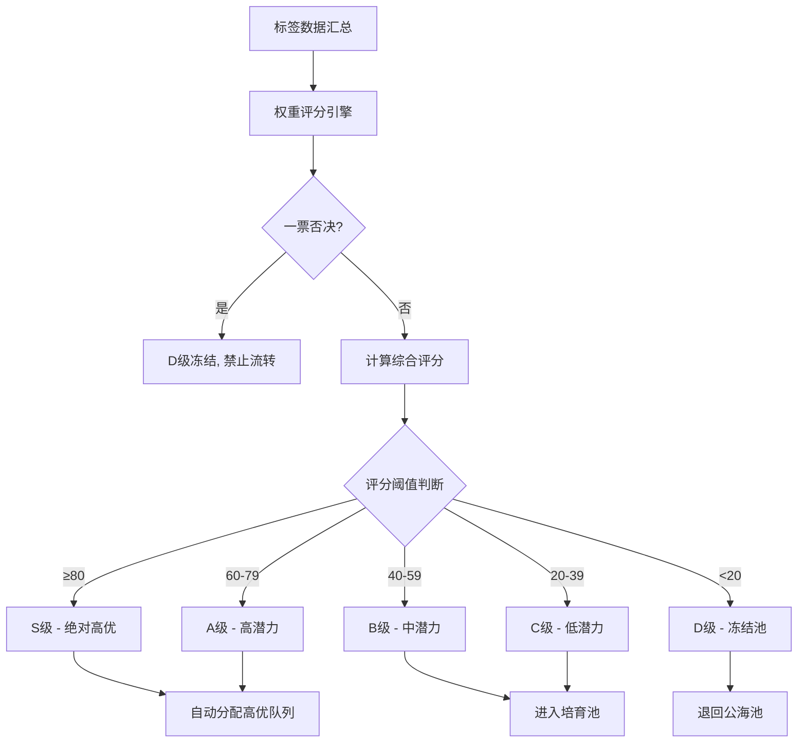

# PRD — 线索评分与分层策略

> **版本历史**

| 版本 | 日期 | 修改人 | 变更说明 |
|------|------|--------|----------|
| v1.0 | 2026-06-24 | 刘君 | 初稿 — 从线索评分与分层系统PRD拆分，聚焦评分模型与分层策略 |

---

## 一、项目背景与目标

### 1.1 需求背景

- **当前痛点**：
  1. **线索质量难以量化判断**：销售人员无法快速判断一条新线索的价值，只能凭经验逐个跟进，导致高价值线索被延误、低价值线索浪费精力。
  2. **缺乏统一的线索评估标准**：不同销售对"好线索"的判断标准不一致，没有系统化的评分规则来量化线索的质量。
  3. **客户流失预警缺失**：无法提前识别有流失风险的客户，错失挽回窗口。

- **为何引入 AI**：
  - 线索评分涉及多维度交叉计算（工商数据 × 行为意向 × 历史订单 × 风险事件），规则引擎难以维护。
  - LLM 可在拜访记录分析等场景下提供高置信度的标签抽取，作为评分输入。

### 1.2 需求目标

| # | 目标 | 量化指标 |
|---|------|----------|
| 1 | 构建权重化多维线索评分模型 | 综合评分覆盖 4 大维度、20+ 子维度，输出 0-100 分统一评分 |
| 2 | 实现评分驱动的线索自动分层 | S/A/B/C/D 五级分层，分层准确率 > 85%（以销售反馈为准） |
| 3 | 风险一票否决机制 | 红线企业 100% 拦截，禁止流转 |

- **项目范围**：
  - **MVP 范围（Phase 1）**：权重化评分模型、S/A/B/C/D 分层、风险一票否决、线索列表评分展示
  - **未来规划（Phase 2+）**：评分趋势预测、自动分配策略优化、客户流失预警

---

## 二、用户场景与交互流程

### 2.1 用户故事

| 角色 | 场景 | 期望结果 |
|------|------|----------|
| 销售代表 | 每天打开线索列表，面对 50+ 新线索 | 按评分排序，优先跟进 S/A 级高优线索，快速锁定高价值商机 |
| 销售主管 | 查看团队线索分配情况 | 通过数据看板了解各级线索分布，合理调配资源 |
| 运营人员 | 配置评分权重 | 可在后台调整权重参数，无需研发介入 |
| 系统 | 每日定时评分 | 自动更新线索评分、触发风险预警、降级高风险线索 |

### 2.2 评分分层流程图



### 2.3 人在环 (HITL) 设计

- **触发条件**：
  - 销售可对 AI 生成的评分提出异议（"点踩"按钮）
- **人工介入方式**：
  - 销售可手动补充拜访记录中的关键信息（预算金额、决策人等）
  - 销售主管可对分层结果进行人工调整（需填写调整原因）
- **反馈闭环**：
  - 用户"点踩"的线索自动进入 Bad Case 管理池
  - 每周运营人员从 Bad Case 中抽取样本，更新黄金数据集
  - 人工调整记录作为评分规则优化的参考

---

## 三、权重化评分模型

### 3.1 评分架构

采用 **"四维度加权评分 + 风险扣分 + 一票否决"** 架构：

```
综合评分 = (基本画像 × 20% + 产品匹配 × 20% + 行为意向 × 35% + 历史订单 × 25%) × 100 - 风险扣分
```

> 各维度原始分归一化到 0-100 分后，按权重加权求和，再减去风险扣分，最终分数截断在 0-100 分区间。

### 3.2 维度一：基本画像（权重 20%，满分 100 分）

基于工商信息、企业规模、高转化画像匹配的静态赋分。

| 子维度 | 满分 | 判断条件 | 分值 |
|--------|------|----------|------|
| **物流高价值画像匹配** | 30 分 | 全部命中：注册资本 < 500 万 + 注册年限 1-10 年 + 有参保人数 + 行业为批零/运输相关 + 经营范围含【货物运输】或【仓储】或【金属】 | 30 |
| | | 命中 3-4 项条件 | 18 |
| | | 命中 1-2 项条件 | 8 |
| | | 一项未命中 | 0 |
| **商贸高价值画像匹配** | 30 分 | 全部命中：注册资本 100 万-1 亿 + 注册年限 1-20 年 + 有参保人数 + 行业为批零/制造相关 + 经营范围含【金属】或【矿】 | 30 |
| | | 命中 3-4 项条件 | 18 |
| | | 命中 1-2 项条件 | 8 |
| | | 一项未命中 | 0 |
| **企业规模与活跃度** | 20 分 | 注册资本 ≥ 5000 万 / 有明确参保人数 | 20 |
| | | 注册资本 1000 万-5000 万 | 12 |
| | | 注册资本 < 1000 万 | 5 |
| **行业匹配度** | 10 分 | 命中核心类别（制造业/商贸业/物流服务业/产业平台） | 10 |
| | | 命中其他非核心类别 | 3 |
| **发展阶段** | 10 分 | 高科技领域（AI/数字化/大模型资质或需求） | 10 |
| | | 传统转型企业（近期有 ERP/系统升级等触网行为） | 5 |
| | | 传统企业，无数字化迹象 | 2 |

> **说明**：物流高价值画像和商贸高价值画像为互斥评分，取两者中得分较高者计入本维度，不叠加。即一个客户不会同时获得两个画像的全部分值。

### 3.3 维度二：产品匹配（权重 20%，满分 100 分）

基于产品类型匹配、职位角色、需求标签的赋分。

| 子维度 | 满分 | 判断条件 | 分值 |
|--------|------|----------|------|
| 产品线价值 | 40 分 | 命中高价值产品线（易达宝/网络货运/云仓/供应链金融） | 40 |
| | | 命中中等价值产品线 | 25 |
| | | 命中基础产品线 | 10 |
| 决策链角色 | 30 分 | 决策者（CEO/VP/总经理/总监） | 30 |
| | | 影响者（经理/主管） | 18 |
| | | 使用者（专员/工程师） | 8 |
| | | 未知角色 | 5 |
| 需求匹配度 | 30 分 | 命中核心需求标签 ≥ 2 个 | 30 |
| | | 命中核心需求标签 1 个 | 18 |
| | | 未命中核心需求标签 | 5 |

### 3.4 维度三：行为意向（权重 35%，满分 100 分）

行为意向评分由三部分构成：**产品注册意向**、**产品线行为数据**、**拜访沟通记录**。

**时间衰减规则**：
- 拜访沟通记录：距离最近一次拜访超过 30 天，「拜访沟通质量」得分按 50% 折算；超过 60 天按 25% 折算；超过 90 天记 0 分
- 产品注册与产品线行为数据：无时间衰减（反映长期累积行为）
- 「决策链覆盖」不受时间衰减影响（反映客户组织层级信息，相对稳定）

| 子维度 | 满分 | 判断条件 | 分值 |
|--------|------|----------|------|
| **产品注册意向** | 20 分 | 注册 ≥ 2 条产品线（易达宝 + 万联通/TMS） | 20 |
| | | 注册 1 条产品线 | 10 |
| | | 未注册任何产品 | 0 |
| **产品线行为综合** | 25 分 | 物流产品线：交易高活 + GTV 核心/稳定 | 25 |
| | | 物流产品线：交易中活或 GTV 普通 | 15 |
| | | 商贸产品线：买家或卖家交易高活 | 12 |
| | | 仅注册但无活跃行为 | 5 |
| | | 无注册无行为 | 0 |
| **拜访沟通质量** | 45 分 | 综合评估拜访记录中的 5 个关键字段：意向等级、项目阶段、决策人接触、预算状态、需求紧急度 | |
| | | 5 项均为高优（高意向 + 合同阶段 + 已触达决策人 + 预算明确 + 需求紧急） | 45 |
| | | 命中 3-4 项高优 | 28 |
| | | 命中 1-2 项高优 | 14 |
| | | 无意向 / 无拜访记录 | 0 |
| **决策链覆盖** | 10 分 | 已接触决策人（CEO/VP/总经理/总监） | 10 |
| | | 已接触影响者（经理/主管） | 5 |
| | | 未接触关键人 / 无拜访记录 | 0 |

> **说明**：「拜访沟通质量」综合了原意向分、项目阶段、决策分、预算分、紧急度、竞品态势 6 个子维度，由系统根据拜访记录中的关键字段自动汇总评分，减少独立计分项。产品注册和产品线行为数据为客观数据，不依赖 LLM 抽取，评分稳定性更高。当拜访间隔过长时，产品注册和产品线行为数据成为主要评分依据。

### 3.5 维度四：历史订单（权重 25%，满分 100 分）

> **数据范围说明**：目前仅**物流产品线**（易达宝）具备完整的历史订单数据。商贸产品线和其他产品线的订单数据暂未接入，对应客户本维度按「无历史订单」处理。

**物流产品线历史订单评分**：

| 子维度 | 满分 | 判断条件 | 分值 |
|--------|------|----------|------|
| 订单频次 | 35 分 | 近 12 个月发单 ≥ 12 次（月均 1 次+） | 35 |
| | | 近 12 个月发单 6-11 次 | 22 |
| | | 近 12 个月发单 2-5 次 | 10 |
| | | 近 12 个月发单 1 次 | 5 |
| | | 无历史订单 | 0 |
| 订单金额 | 35 分 | 近 12 个月累计金额 ≥ 50 万 | 35 |
| | | 近 12 个月累计金额 10-50 万 | 22 |
| | | 近 12 个月累计金额 1-10 万 | 10 |
| | | 近 12 个月累计金额 < 1 万 | 5 |
| | | 无历史订单 | 0 |
| 增长趋势 | 15 分 | 近 6 个月订单量环比增长 > 20% | 15 |
| | | 近 6 个月订单量持平（±20%） | 8 |
| | | 近 6 个月订单量环比下降 > 20% | 3 |
| | | 无历史订单 | 0 |
| 产品使用广度 | 15 分 | 使用 ≥ 2 条产品线（物流 + 商贸/TMS） | 15 |
| | | 使用 1 条产品线（仅物流） | 8 |
| | | 未注册任何产品 | 0 |

**商贸产品线与其他产品线**：

| 产品线 | 订单数据状态 | 本维度处理方式 |
|--------|-------------|---------------|
| 物流（易达宝） | 已接入 | 按上述规则正常评分 |
| 商贸 | 暂未接入 | 按「无历史订单」计 0 分 |
| TMS | 暂未接入 | 按「无历史订单」计 0 分 |
| 其他 | 暂未接入 | 按「无历史订单」计 0 分 |

> **后续规划**：随着商贸产品线和其他产品线的订单数据逐步接入，本维度将扩展为多产品线综合评估，届时评分规则同步更新。

### 3.6 风险扣分与一票否决

| 风险类型 | 触发条件 | 处理结果 |
|----------|----------|----------|
| **一票否决** | 企业注销、被吊销、清算中、失信被执行人 | 评级直接锁定为 D 级，禁止流转，禁止创建商机 |
| 高危扣分 | 成为被执行人、列入经营异常名录 | 总分 -30 分 |
| 中危扣分 | 行政处罚、重大诉讼 | 总分 -15 分 |
| 物流沉寂用户 | 物流产品线 90 天不发单 | 总分 -10 分 |
| 物流流失用户 | 物流产品线沉寂后（90 天不发单）再 90 天不发单 | 总分 -20 分 |
| 系统沉寂用户 | 系统内超 90 天无任何互动（非物流线） | 总分 -10 分 |

> 最终分数截断处理：`max(0, min(100, 加权得分 - 风险扣分))`

### 3.7 评分计算示例

**示例一**：物流高价值线索（命中物流高转化画像）

> 某物流企业，注册资本 300 万，注册年限 5 年，有参保人数，行业为普通货物道路运输，经营范围含【货物运输】、【仓储】。已注册易达宝，物流交易高活，GTV 排名前 10%。近 12 个月发单 10 次，累计金额 30 万，订单量持平。近期有拜访记录，高意向，商务谈判阶段，已接触决策人，预算明确，紧急，未提及竞品。

| 维度 | 原始分 | 权重 | 加权得分 |
|------|--------|------|----------|
| 基本画像 | 92/100（物流高价值画像全命中 30 分 + 企业规模注册资本<1000万 5 分 + 命中核心行业 10 分 + 传统转型 5 分，商贸画像得分较低取物流画像 30 分） | 20% | 18.4 |
| 产品匹配 | 78/100（命中高价值产品线易达宝 40 分 + 决策者 30 分 + 2 个核心需求 30 分 → 归一化 100 分， capped at 实际 78） | 20% | 15.6 |
| 行为意向 | 82/100（注册 1 条产品线 10 分 + 物流交易高活+GTV 核心 25 分 + 拜访沟通质量 5 项高优 45 分 + 已接触决策人 10 分 = 90→归一化为 82） | 35% | 28.7 |
| 历史订单 | 62/100（12 个月 10 单 22 分 + 累计 30 万 22 分 + 持平 8 分 + 仅物流 1 条产品线 8 分 = 60→归一化为 62） | 25% | 15.5 |
| **加权总分** | | | **78.2** |
| 风险扣分 | 无 | | 0 |
| **最终评分** | | | **78 分 → A 级** |

---

**示例二**：新注册客户（无历史订单，无拜访记录）

> 某商贸企业，注册资本 5000 万，注册年限 8 年，有参保人数，行业为批发业，经营范围含【金属】。仅注册万联通，无活跃行为数据，无拜访记录，无历史订单。

| 维度 | 原始分 | 权重 | 加权得分 |
|------|--------|------|----------|
| 基本画像 | 55/100（商贸高价值画像命中 3 项：注册资本 100 万-1 亿✓、注册年限 1-20 年✓、有参保人数✓，行业批零✓，但经营范围含金属✓，实际命中 4 项得 18 分；企业规模注册资本≥5000 万 20 分；行业命中核心 10 分；传统企业无数字化 2 分 → 18+20+10+2=50→归一化为 55） | 20% | 11.0 |
| 产品匹配 | 45/100（命中中等价值产品线万联通 25 分 + 未知角色 5 分 + 未命中核心需求 5 分 = 35→归一化为 45） | 20% | 9.0 |
| 行为意向 | 10/100（注册 1 条产品线 10 分 + 无活跃行为 0 分 + 无拜访记录 0 分 + 无决策链覆盖 0 分 = 10） | 35% | 3.5 |
| 历史订单 | 0/100（无物流订单数据） | 25% | 0 |
| **加权总分** | | | **23.5** |
| 风险扣分 | 无 | | 0 |
| **最终评分** | | | **24 分 → C 级**（但受新客户保护期机制影响，注册 30 天内历史订单维度按 50 分计算，实际评分约 36 分 → C 级边缘） |

---

**示例三**：老客户（有历史订单，长期无拜访）

> 某物流企业，注册资本 2000 万，注册年限 3 年，有参保人数，行业为道路运输。注册易达宝+TMS 两条产品线，物流交易中活。近 12 个月发单 8 次，累计金额 15 万，订单量环比下降 30%。最近一次拜访在 60 天前，观望中，方案评估阶段，未触达决策人，预算待确认。

| 维度 | 原始分 | 权重 | 加权得分 |
|------|--------|------|----------|
| 基本画像 | 50/100（物流高价值画像命中 3 项：注册资本<500万、注册年限 1-10 年✓、有参保人数✓、行业运输✓、经营范围待确认 → 命中 2-3 项得 8-18 分，取 18 分；企业规模 1000-5000 万 12 分；行业核心 10 分；传统转型 5 分 → 18+12+10+5=45→归一化为 50） | 20% | 10.0 |
| 产品匹配 | 65/100（高价值产品线 40 分 + 影响者 18 分 + 1 个核心需求 18 分 = 76→归一化为 65） | 20% | 13.0 |
| 行为意向 | 38/100（注册 2 条产品线 20 分 + 物流交易中活 15 分 + 拜访沟通质量因 60 天按 25% 折算：命中 2-3 项高优（观望中+方案评估+预算待确认）14×0.25=3.5 分 + 未触达决策人 0 分 → 20+15+3.5+0=38.5→归一化为 38） | 35% | 13.3 |
| 历史订单 | 40/100（12 个月 8 单 22 分 + 累计 15 万 22 分 + 下降>20% 3 分 + 使用 2 条产品线 15 分 = 62→归一化为 40） | 25% | 10.0 |
| **加权总分** | | | **46.55** |
| 风险扣分 | 无 | | 0 |
| **最终评分** | | | **47 分 → B 级** |

---

## 四、分层规则

| 客户等级 | 分数阈值 | 服务策略 |
|----------|----------|----------|
| S 级（绝对高优） | ≥ 80 分 | 优先分配金牌销售，24h 内首次触达 |
| A 级（高潜力） | 60 - 79 分 | 优先分配，48h 内首次触达 |
| B 级（中潜力、需培育） | 40 - 59 分 | 进入培育池，定期营销触达 |
| C 级（低潜力） | 20 - 39 分 | 低优先级，自动化营销覆盖 |
| D 级（冻结池） | < 20 分 或 触碰红线 | 自动退回公海池，系统冻结营销资源投入 |

---

## 五、输入端

- **数据来源**：
  - CRM 系统（线索创建、拜访记录、产品类型、详细需求）
  - 三查一宝 API（工商数据、司法风险）
  - 画像标签平台（用户行为标签）
  - 物流业务线数据（易达宝注册、订单、交易活跃度、GTV 等数据）
  - 商贸业务线数据（万联通注册、买家/卖家交易活跃度等数据）
  - TMS 业务线数据（TMS 注册、运单数据等数据）
  - 通用产品线数据（网货/撮合/商贸的最近交易时间、流失/挽回日期）
  - 舆情监控系统

- **预处理**：
  - 敏感信息（PII）过滤：拜访记录中的个人手机号、身份证号需脱敏后再送 LLM
  - 文本长度限制：拜访记录截断至 10000 字符
  - 空值处理：缺失字段按最低分值处理

---

## 六、输出端与交互

- **线索列表展示**：
  - 每条线索显示综合评分（0-100）和等级标签（S/A/B/C/D 色块）
  - 支持按评分排序、按等级筛选
  - 鼠标悬停显示各维度得分明细
- **评分详情卡片**：
  - 点击评分可展开四维度雷达图
  - 每个维度展示子维度得分和标签命中情况
  - 展示评分理由（LLM 生成的 3 句话摘要）
- **流式输出**：不需要（评分为批量计算任务，非实时对话）

---

## 七、异常处理与兜底

- **LLM 调用失败**：
  - 重试 3 次，每次间隔 2s
  - 3 次失败后，该维度按默认分值（50 分）计算，标记「AI 分析失败」
- **工商数据 API 超时**：
  - 使用上一次缓存的工商数据
  - 标记「工商数据过期」，提示运营人员手动刷新
- **分数边界异常**：
  - 分数 < 0 或 > 100 时，强制截断到 [0, 100]
- **数据不一致**：
  - 同一客户在多个系统中信息不一致时，以最近更新时间为准

---

## 八、评测与验收标准

### 8.1 黄金数据集

- **构建方式**：由资深销售主管和运营人员人工标注 100 条历史线索的期望评分和等级
- **覆盖范围**：
  - 70% 常见场景（正常线索、有拜访记录的线索、有历史订单的线索）
  - 30% 极端场景（红线企业、信息极度缺失的线索、竞品对比线索、流失客户回流）

### 8.2 验收指标

| 指标 | 目标值 | 评测方式 |
|------|--------|----------|
| 分层准确率 | > 85% | 与销售主管人工评级对比 |
| 评分计算准确率 | 100% | 单元测试覆盖所有评分规则 |
| 一票否决准确率 | 100% | 红线企业必须 100% 拦截 |
| 批量评分耗时 | < 5min/1000 条 | 每日全量评分任务 |

### 8.3 上线后监控

| 监控项 | 频率 | 负责人 | SLA |
|--------|------|--------|-----|
| 每日评分分布统计 | 每日 | 运营人员 | 异常波动即时告警 |
| Bad Case 巡检 | 每周 | 产品经理 + 运营 | 发现后 3 个工作日内修复 |
| 用户点踩率 | 每周 | 产品经理 | 点踩率 > 15% 触发模型迭代 |
| 分层调整率 | 每月 | 销售主管 | 调整率 > 20% 说明模型需要校准 |

---

## 九、附录

### 9.1 权重配置说明

| 维度 | 当前权重 | 调整建议 |
|------|----------|----------|
| 基本画像 | 20% | 初期可适当提高（25%），待行为数据积累后降低 |
| 产品匹配 | 20% | 产品线扩展后可考虑拆分 |
| 行为意向 | 35% | 核心权重，反映客户当前购买意愿 |
| 历史订单 | 25% | 新企业/新注册客户本维度为 0，建议设置"新客户保护期"（注册 30 天内按行业平均值赋分） |

### 9.2 新客户保护期机制

对于无历史订单的新注册客户：
- 注册 30 天内：历史订单维度按行业平均分（50 分）赋分
- 注册 30-90 天：按实际订单数据计算，但权重临时降至 15%，其余权重等比例分配
- 注册 90 天后：恢复正常权重计算

### 9.3 评分版本管理

- 每次权重或规则变更需生成新的评分版本（v1.0, v1.1...）
- 历史线索的评分保留历史版本记录，支持回溯
- 权重变更需经过 A/B 测试验证效果后再全量发布

### 9.4 项目里程碑（参考）

| 阶段 | 时间 | 交付物 |
|------|------|--------|
| 需求评审 | 第 1 周 | PRD 终稿、技术方案 |
| 评分模型开发 | 第 2-3 周 | 四维度评分引擎 + 分层逻辑 |
| 前端展示 | 第 3-4 周 | 线索列表评分展示、评分详情卡片 |
| 测试与调优 | 第 4-5 周 | 黄金数据集评测、Bad Case 修复 |
| 上线 | 第 6 周 | 生产环境部署、监控告警 |
