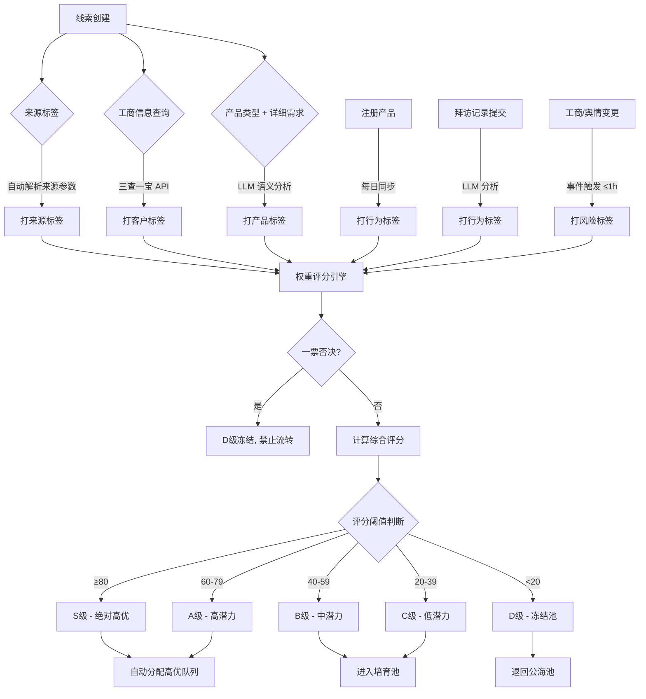

# PRD — 线索评分与分层系统

> **版本历史**

| 版本 | 日期 | 修改人 | 变更说明 |
|------|------|--------|----------|
| v1.0 | 2026-06-23 | 刘君 | 初稿 — 基于权重模型重构线索评分体系，新增历史订单维度 |
| v1.1 | 2026-06-24 | 刘君 | 扩展行为意向维度：增加注册产品标签（易达宝/万联通/TMS）、三条产品线行为数据标签（物流/商贸/通用）；调整历史订单维度：明确仅物流产品线有订单数据，商贸/TMS 按无历史订单处理；调整行为意向和历史订单的子维度分值权重 |
| v1.2 | 2026-06-24 | 刘君 | 基本画像维度新增高转化画像匹配评分：物流高价值画像（注册资本<500万+注册年限1-10年+参保人数+批零/运输行业+经营范围含货物运输/仓储/金属）、商贸高价值画像（注册资本100万-1亿+注册年限1-20年+参保人数+批零/制造行业+经营范围含金属/矿）；新增对应的客户标签（物流高价值线索/商贸高价值线索）；画像互斥取高分，不叠加 |
| v1.3 | 2026-06-24 | 刘君 | 更新评分计算示例为三个典型场景（物流高价值线索S级、新注册客户C级、老客户长期无拜访B级），充分体现高转化画像、产品注册、行为衰减等评分逻辑 |
| v1.4 | 2026-06-24 | 刘君 | 风险扣分细化：物流产品线沉寂用户（90天不发单）扣10分，物流流失用户（沉寂后再90天不发单）扣20分，系统沉寂用户（非物流线超90天无互动）扣10分 |

---

## 一、项目背景与目标

### 1.1 需求背景

- **当前痛点**：
  1. **客户信息碎片化**：客户的基础信息、交易数据、服务记录、产品使用情况分散在不同系统中，缺乏统一的客户标签体系来整合这些维度，销售无法快速获得完整的客户信息。
  2. **线索质量难以量化判断**：当前 CRM 系统中已有丰富的客户数据标签（来源、客户、产品、行为、风险），但尚未形成量化的评价体系。销售人员无法快速判断一条新线索的价值，只能凭经验逐个跟进，导致高价值线索被延误、低价值线索浪费精力。
  3. **缺乏统一的线索评估标准**：不同销售对"好线索"的判断标准不一致，没有系统化的标签体系和评分规则来量化线索的质量。
  4. **客户流失预警缺失**：无法提前识别有流失风险的客户，错失挽回窗口。

- **为何引入 AI**：
  - 拜访记录、招投标信息、详细需求等文本数据需要语义理解才能提取结构化标签，传统关键词匹配误判率高。
  - 线索评分涉及多维度交叉计算（工商数据 × 行为意向 × 历史订单 × 风险事件），规则引擎难以维护。
  - LLM 可在拜访记录分析、招投标分析、需求语义匹配等场景下提供高置信度的标签抽取。

### 1.2 需求目标

| # | 目标 | 量化指标 |
|---|------|----------|
| 1 | 构建权重化多维线索评分模型 | 综合评分覆盖 4 大维度、20+ 子维度，输出 0-100 分统一评分 |
| 2 | 实现评分驱动的线索自动分层 | S/A/B/C/D 五级分层，分层准确率 > 85%（以销售反馈为准） |
| 3 | 风险一票否决机制 | 红线企业 100% 拦截，禁止流转 |
| 4 | 标签自动打标覆盖率 | 来源标签 100%、产品标签 > 90%、行为标签 > 80% |

- **项目范围**：
  - **MVP 范围（Phase 1）**：标签自动打标引擎、权重化评分模型、S/A/B/C/D 分层、风险一票否决、线索列表评分展示
  - **未来规划（Phase 2+）**：评分趋势预测、自动分配策略优化、竞品分析增强、客户流失预警

---

## 二、用户场景与交互流程

### 2.1 用户故事

| 角色 | 场景 | 期望结果 |
|------|------|----------|
| 销售代表 | 每天打开线索列表，面对 50+ 新线索 | 按评分排序，优先跟进 S/A 级高优线索，快速锁定高价值商机 |
| 销售主管 | 查看团队线索分配情况 | 通过数据看板了解各级线索分布，合理调配资源 |
| 运营人员 | 配置标签规则和评分权重 | 可在后台调整标签命中规则和权重参数，无需研发介入 |
| 系统 | 每日定时扫描工商数据 | 自动更新客户标签、触发风险预警、降级高风险线索 |

### 2.2 业务流程图



### 2.3 人在环 (HITL) 设计

- **触发条件**：
  - LLM 标签抽取置信度 < 0.7 时，标记为「待确认」，需销售人工核实
  - 销售可对 AI 生成的评分提出异议（"点踩"按钮）
- **人工介入方式**：
  - 销售可手动补充拜访记录中的关键信息（预算金额、决策人等）
  - 销售主管可对分层结果进行人工调整（需填写调整原因）
- **反馈闭环**：
  - 用户"点踩"的线索自动进入 Bad Case 管理池
  - 每周运营人员从 Bad Case 中抽取样本，更新黄金数据集
  - 人工调整记录作为 Prompt 优化的 Few-Shot 示例

---

## 三、AI 核心任务定义

### 3.1 任务一：拜访记录标签抽取

- **任务类型**：信息抽取 (Extraction) + 分类 (Classification)
- **输入字段定义**：

| 字段 | 类型 | 来源 | 说明 |
|------|------|------|------|
| visit_record | string | CRM 拜访记录 | 销售提交的拜访文本内容 |
| customer_name | string | CRM 客户信息 | 客户企业名称 |
| salesperson_name | string | CRM 销售人员 | 拜访执行人 |
| visit_date | string | CRM 拜访记录 | 拜访日期，格式 YYYY-MM-DD |
| tag_library | object | 标签配置表 | 预设标签库 JSON（按意向度/态度/竞品/异议/动作/决策人/预算/紧急度分组） |

- **输出字段定义**：

| 字段 | 类型 | 说明 |
|------|------|------|
| intent_level | string | 意向等级：高意向 / 观望中 / 低意向 / 流失风险 |
| customer_attitude | string | 客户态度：积极 / 中性 / 消极 / 强烈不满 |
| competitor_mentioned | array\<string\> | 提及的竞品名称列表 |
| objection_type | array\<string\> | 异议类型：价格敏感 / 功能异议 / 实施异议 / 服务异议 / 决策异议 |
| next_action | string | 下一步动作：已约下次拜访 / 等客户反馈 / 需销售输出 / 待跟进 |
| decision_maker_reached | boolean | 是否接触决策人 |
| budget_status | string | 预算状态：预算充足 / 预算不足 |
| urgency | string | 紧急程度：紧急 / 近期（1-3个月） / 长期（>3个月） |
| confidence | number | 整体置信度，0-1 |
| reason | string | 评分理由，3 句话以内 |

- **输入 (Input)**：一段销售拜访记录文本（500-3000 字） + 客户企业名称 + 预设标签库
- **输出 (Output)**：JSON 格式结构化标签数据，用于行为标签打标和动态行为评分

### 3.2 任务二：招投标信息分析

- **任务类型**：信息抽取 (Extraction) + 分析 (Analysis)
- **输入字段定义**：

| 字段 | 类型 | 来源 | 说明 |
|------|------|------|------|
| company_name | string | 三查一宝 API | 企业全称 |
| bidding_records | array | 招投标数据源 | 历史招投标记录列表，每条包含项目名称、时间、金额、内容摘要 |
| tag_library | object | 标签配置表 | 预设标签库 JSON |

- **输出字段定义**：

| 字段 | 类型 | 说明 |
|------|------|------|
| industry_tags | array\<string\> | 行业标签 |
| business_tags | array\<string\> | 主营业务标签 |
| project_tags | array\<string\> | 项目建设标签 |
| demand_tags | array\<string\> | 采购需求标签 |
| opportunity_tags | array\<string\> | 商机标签 |
| digital_level | string | 数字化成熟度 |
| procurement_level | string | 采购能力 |
| activity_level | string | 招投标活跃度 |
| customer_level | string | 客户价值等级 |
| core_tags | array\<string\> | 核心标签 |
| analysis_reason | string | 分析依据 |

- **输入 (Input)**：企业近 3 年招投标记录列表
- **输出 (Output)**：JSON 格式企业画像标签，用于客户标签打标和评分加成

### 3.3 任务三：详细需求语义匹配

- **任务类型**：分类 (Classification)
- **输入字段定义**：

| 字段 | 类型 | 来源 | 说明 |
|------|------|------|------|
| company_name | string | CRM 客户信息 | 客户企业名称 |
| product_type | string | CRM 线索创建 | 当前选择的产品类型 |
| detail_requirement | string | CRM 线索创建 | 详细需求描述文本 |
| tag_library | object | 标签配置表 | 标准需求标签库（物流类/仓储类/金融类/交易类/能源类/保险类/数字化类/营销类） |

- **输出字段定义**：

| 字段 | 类型 | 说明 |
|------|------|------|
| demand_tags | array\<string\> | 匹配的需求标签，1-3 个，必须来自标签库 |

- **输入 (Input)**：客户公司名称 + 产品类型 + 详细需求文本
- **输出 (Output)**：JSON 数组格式需求标签

### 3.4 模型选型与配置

| 场景 | 推荐模型 | 理由 |
|------|----------|------|
| 拜访记录标签抽取 | 通义千问 Max / GPT-4o | 需要强语义理解能力，抽取 8 类标签 |
| 招投标信息分析 | 通义千问 Max / GPT-4o | 长文本分析，多维度推理 |
| 详细需求语义匹配 | 通义千问 Plus / GPT-4o-mini | 分类任务，成本敏感 |
| 规则评分计算 | 规则引擎（非 LLM） | 纯数值计算，无需大模型 |

- **参数配置**：
  - Temperature：0.1（信息抽取任务，要求确定性）
  - Top P：0.9
  - Context Window：32k（拜访记录 + 标签库不超过 8k tokens）

### 3.5 提示词策略

#### 拜访记录分析 — System Prompt

```
你是一名销售拜访记录分析专家。请根据销售拜访记录内容，识别客户业务场景、
需求状态、合作意向和项目阶段。

要求：
1. 仅从标签库中选择标签，不允许创造新标签
2. 输出 1-5 个最相关标签
3. 根据语义理解判断，不依赖关键词匹配
4. 支持识别隐含需求
5. 返回标签及置信度

输入：
- 拜访记录：{{visit_record}}
- 客户名称：{{customer_name}}
- 标签库：{{tag_library}}

输出格式（严格 JSON）：
{
  "intent_level": "高意向|观望中|低意向|流失风险",
  "customer_attitude": "积极|中性|消极|强烈不满",
  "competitor_mentioned": ["竞品A"],
  "objection_type": ["价格敏感"],
  "next_action": "已约下次拜访|等客户反馈|需销售输出|待跟进",
  "decision_maker_reached": true,
  "budget_status": "预算充足|预算不足",
  "urgency": "紧急|近期|长期",
  "confidence": 0.95,
  "reason": "简要分析原因"
}
```

#### 招投标分析 — System Prompt

```
你是一名企业招投标信息分析专家。根据企业历史招投标记录，分析企业所属
行业、主营业务、采购需求、项目建设方向、数字化水平、客户价值及潜在商机，
并生成标准化标签。

分析原则：
- 仅依据招投标事实进行分析
- 优先分析近 3 年数据
- 同类项目出现 2 次及以上视为长期需求
- 同类项目出现 3 次及以上视为重点需求
- 若证据不足，明确说明"暂无充分证据支持"
- 禁止主观猜测

输入：
- 企业名称：{{company_name}}
- 历史招投标记录：{{bidding_records}}
```

#### 详细需求语义匹配 — System Prompt

```
你是一名产品需求分析专家。请根据客户公司名称、当前产品类型和详细需求，
识别客户最核心的业务需求，并匹配标准需求标签。

规则：
- 基于需求语义进行判断，不依赖关键词匹配
- 标签必须从标签库中选择，不允许新增标签
- 输出 1-3 个最相关标签
- 优先识别客户真实业务场景和实际诉求
- 当前产品类型仅作为辅助信息，不作为判断依据
- 无法判断时返回空数组

标签库：
- 物流类：找车、找货、整车运输、零担运输、网络货运、运力调度、仓储配送、多式联运
- 仓储类：云仓、仓储管理、智能仓储、监管仓、仓单质押、库存管理
- 金融类：供应链融资、流动资金贷款、票据贴现、保理融资、授信融资、仓储融资
- 交易类：商贸撮合、平台交易、采购需求、销售渠道、供应链协同
- 能源类：油品采购、车队加油、能源供应链
- 保险类：货运保险、车辆保险、金融保险
- 数字化类：智慧场站、数字化转型、AI应用、数据资产
- 营销类：品牌推广、广告投放、联合营销、招商推广

输入：
- 公司名称：{{company_name}}
- 当前产品类型：{{product_type}}
- 详细需求：{{detail_requirement}}

输出格式（严格 JSON）：
{"需求标签": ["标签1", "标签2"]}
```

---

## 四、功能需求

### 4.1 标签体系

#### 4.1.1 标签总览

| 标签类型 | 数据来源 | 触发时机 | 更新频率 |
|----------|----------|----------|----------|
| 来源标签 | CRM 系统 | 线索创建时 | 创建时一次，不重复更新 |
| 客户标签 | 三查一宝（工商数据 API） | 新客户录入 / 工商变更 | 事件触发 + 每日全量 |
| 产品标签 | CRM 系统 — 产品类型 + 详细需求 | 线索创建 | 创建时打标，信息修改时重新匹配 |
| 行为标签 | 产品注册 / 拜访记录 / 画像标签平台 | 注册事件 / 拜访提交 / 每日同步 | 事件触发 / 每日 |
| 风险标签 | 工商 + 舆情 + 回款数据 | 异常事件 | 事件触发 ≤ 1h |

#### 4.1.2 来源标签

| 命中规则 | 标签名称 | 更新规则 |
|----------|----------|----------|
| 线索根据进入渠道（自拓、自访、渠道推介、商贸、各业务系统）自动打标 | 来源-XX 渠道 | 创建时一次，不重复更新 |

- 一个线索只允许有一个来源标签（首次进入渠道为准）
- 来源标签一旦打上不可手动修改，保证溯源数据的真实性
- 来源参数不在配置列表中 → 打上「来源-其他」
- 来源参数为空 → 打上「来源-未知」

#### 4.1.3 客户标签

| 维度 | 命中条件 | 标签示例 | 备注 |
|------|----------|----------|------|
| 注册资本/实缴资本 | ≥5000 万 | 大型 | |
| | 1000 万-5000 万 | 中型 | |
| | <1000 万 | 小型 | |
| 经营状态 | = 注销/吊销 | 已注销/已吊销 | 隶属于风险标签 |
| | = 存续/在业 | 存续/在业 | |
| 企业规模 | 与工商信息一致 | 大型/中型/小型/微型 | |
| 工商行业 | 取最后一级 | 普通货物道路运输 | |
| 物流业务类型 | AI 销售秘书最后一次选择 | 生产制造型-大型 等 | |
| 省份地区 | 注册地区省-市 | 北京市-昌平区 | |
| 被执行人记录 | 三查一宝有记录 | 被执行人 | 风险标签 |
| 失信被执行人 | 三查一宝有记录 | 失信被执行人 | 风险标签 |
| 经营异常 | 列入经营异常名录 | 经营异常 | 风险标签 |
| 行政处罚 | 有行政处罚记录 | 行政处罚 | 风险标签 |
| 股权出质 | 有股权出质记录 | 股权出质 | 风险标签 |
| 动产抵押 | 有动产抵押记录 | 动产抵押 | 风险标签 |
| 清算信息 | 有清算信息 | 清算中 | 风险标签 |
| 法人变更 | 法人信息变更 | 法人变更 | |
| 招投标分析标签 | LLM 分析生成 | 行业/主营业务/采购需求等 | 见 3.2 节 |
| **高价值画像标签** | 见下方高转化画像规则 | 物流高价值线索 / 商贸高价值线索 | 用于评分加成 |

**高转化画像匹配规则**：

| 画像类型 | 命中条件 | 生成标签 |
|----------|----------|----------|
| **物流业务高转化画像** | 注册资本 < 500 万 + 注册年限 1-10 年 + 有参保人数 + 行业为批零/运输相关 + 经营范围含【货物运输】或【仓储】或【金属】 | 物流高价值线索 |
| **商贸业务高转化画像** | 注册资本 100 万-1 亿 + 注册年限 1-20 年 + 有参保人数 + 行业为批零/制造相关 + 经营范围含【金属】或【矿】 | 商贸高价值线索 |

> 高转化画像标签用于基本画像维度评分加成（见 4.2.2 节），命中全部条件得满分 30 分，命中 3-4 项得 18 分，命中 1-2 项得 8 分。两个画像互斥，取得分较高者，不叠加。

#### 4.1.4 产品标签

| 维度 | 命中规则 | 标签示例 |
|------|----------|----------|
| 职位角色 | 根据职务关键词匹配 | 总经理 / 经理 / 专员 / 未知 |
| 需求标签 | LLM 分析详细需求 + 产品类型 | 整车物流-易达宝 / 网络货运 |
| 业务需求标签 | LLM 语义匹配标准标签库 | 找车 / 找货 / 云仓 / 供应链融资 等 |

职位角色映射规则：
- 决策者：CEO / VP / 总经理 / 总监
- 影响者：经理 / 主管
- 使用者：专员 / 工程师 / 未知角色

#### 4.1.5 行为标签

行为标签的数据来源包括三部分：**注册产品**、**产品线行为数据**、**拜访记录分析**。

**注册产品标签**：

| 命中规则 | 生成标签 |
|----------|----------|
| 注册易达宝 | 注册：易达宝 |
| 注册万联通 | 注册：万联通 |
| 注册 TMS | 注册：TMS |
| 注册多条产品（≥2条） | 注册：多产品用户 |

> 注册标签由每日定时同步任务自动打标，注册多个产品的客户同时获得多个注册标签。

**产品线行为数据标签**：

系统支持三条产品线的行为数据追踪：**物流**、**商贸**、**通用（网货/撮合/商贸）**。各产品线的行为数据维度如下：

**物流产品线行为标签**：

| 数据维度 | 分级标准 | 生成标签 |
|----------|----------|----------|
| 物流注册日期 | 有注册 | 物流-已注册 |
| 物流交易活跃度 | 高/中/低 | 物流交易：高活/中活/低活 |
| 物流业务价值 | 高/中/低 | 物流价值：高/中/低 |
| 物流访问活跃度（访问活跃天数） | 高/中/低 | 物流访问：高活/中活/低活 |
| 生命周期 | 无成交/7天内有成交/14天内有成交/21天内有成交/28天内有成交/轻度流失/重度流失 | 物流生命周期：XX |
| GTV 占比价值 | 核心（GTV 前 10%）/ 稳定（10%-30%）/ 普通（30%-80%）/ 潜力 | 物流 GTV 地位：核心/稳定/普通/潜力 |
| GTV 排名价值 | 核心（排名前 10%）/ 稳定（10%-30%）/ 普通（30%-80%）/ 潜力 | 物流 GTV 排名：核心/稳定/普通/潜力 |

**商贸产品线行为标签**：

| 数据维度 | 分级标准 | 生成标签 |
|----------|----------|----------|
| 商贸注册日期 | 有注册 | 商贸-已注册 |
| 商贸登录活跃度 | 高/中/低 | 商贸登录：高活/中活/低活 |
| 商贸买家交易活跃度 | 高/中/低 | 商贸买家交易：高活/中活/低活 |
| 商贸卖家交易活跃度 | 高/中/低 | 商贸卖家交易：高活/中活/低活 |
| 买家业务价值 | 高/中/低 | 商贸买家价值：高/中/低 |
| 卖家业务价值 | 高/中/低 | 商贸卖家价值：高/中/低 |

**通用产品线行为标签**（网货/撮合/商贸）：

| 数据维度 | 分级标准 | 生成标签 |
|----------|----------|----------|
| 最近一次交易时间 | 近 7 天 / 近 30 天 / 近 90 天 / >90 天 | 全平台交易：活跃/近期/沉寂/流失 |
| 流失日期 | 判定为流失 | 全平台流失用户 |
| 挽回日期 | 判定为挽回 | 全平台挽回用户 |

**拜访分析标签**（基于 LLM 抽取）：

| 维度 | 命中条件 | 生成标签 |
|------|----------|----------|
| 意向度 | 明确采购意愿 / 询问报价 / 要求出合同 | 高意向 |
| | 表达兴趣但需内部讨论 / "考虑中" | 观望中 |
| | 明确不需要 / 已选竞品 / 预算不足 | 低意向 |
| | 退订 / 不满 / 投诉 / 考虑更换供应商 | 流失风险 |
| 客户态度 | 很好 / 期待合作 / 主动推进 | 积极 |
| | 知道了 / 再看看 / 态度平淡 | 中性 |
| | 不满意 / 太贵 / 抱怨 | 消极 |
| | 情绪激动 / 威胁 | 强烈不满 |
| 竞品提及 | 提及竞品名称 | 提及【竞品名】 |
| | 已选择竞品 | 已选【竞品名】 |
| | 多家竞品对比 | 竞品对比 |
| 异议类型 | 价格过高 / 预算不足 | 价格敏感 |
| | 功能不满足 | 功能异议 |
| | 实施难度大 | 实施异议 |
| | 服务响应慢 | 服务异议 |
| | 需上级审批 | 决策异议 |
| 下一步动作 | 约定下次拜访 | 已约下次拜访 |
| | 客户承诺提供资料 | 等客户反馈 |
| | 销售承诺发送方案 | 需销售输出 |
| | 未明确 | 待跟进 |
| 决策人触达 | 拜访对象为董事长/总经理/VP | 已接触决策人 |
| | 拜访对象为中间人/执行层 | 未触达决策人 |
| 预算状态 | 明确提及预算金额 | 预算充足 |
| | 预算不足 / 被砍 | 预算不足 |
| 紧急程度 | 明确提及启动时间/截止日期 | 紧急 |
| | 近期有采购计划 | 近期（1-3个月） |
| | 长期规划 / 暂无时间表 | 长期（>3个月） |

#### 4.1.6 风险标签

| 触发条件 | 生成标签 | 风险等级 | 后续动作 |
|----------|----------|----------|----------|
| 被执行人记录 | 被执行人 | 高 | 推送负责销售 + 主管 |
| 失信被执行人 | 失信被执行人 | 高 | 推送负责销售 + 主管 |
| 经营异常 | 经营异常 | 高 | 推送负责销售 + 主管 |
| 行政处罚 | 行政处罚 | 中 | 推送负责销售 |
| 清算信息 | 清算中 | 高 | 推送负责销售 + 主管 |
| 注销/吊销 | 已注销/已吊销 | 高 | 推送销售+主管，转入公海 |
| 重大诉讼/仲裁 | 诉讼风险 | 中 | 推送负责销售 |
| 高管变动/负面新闻 | 高管变动 | 低 | 画像更新 |
| 物流线 90 天不发单 | 沉寂用户 | 低 | 标记，纳入沉寂预警 |
| 沉寂后再 90 天不发单 | 流失用户 | 低 | 标记，纳入流失预警 |

### 4.2 权重化评分模型

#### 4.2.1 评分架构

采用 **"四维度加权评分 + 风险扣分 + 一票否决"** 架构：

```
综合评分 = (基本画像 × 20% + 产品匹配 × 20% + 行为意向 × 35% + 历史订单 × 25%) × 100 - 风险扣分
```

> 各维度原始分归一化到 0-100 分后，按权重加权求和，再减去风险扣分，最终分数截断在 0-100 分区间。

#### 4.2.2 维度一：基本画像（权重 20%，满分 100 分）

基于工商信息、企业规模、高转化画像匹配的静态赋分。

| 子维度 | 满分 | 判断条件 | 分值 |
|--------|------|----------|------|
| **物流高价值画像匹配** | 30 分 | 全部命中：注册资本 < 500 万 + 注册年限 1-10 年 + 有参保人数 + 行业为批零/运输相关 + 经营范围含【货物运输】或【仓储】或【金属】 | 30 |
| | | 命中 3-4 项条件 | 18 |
| | | 命中 1-2 项条件 | 8 |
| | | 一项未命中 | 0 |
| **商贸高价值画像匹配** | 30 分 | 全部命中：注册资本 100 万-1 亿 + 注册年限 1-20 年 + 有参保人数 + 行业为批零/制造相关 + 经营范围含【金属】或【矿】 | 30 |
| | | 命中 3-4 项条件 | 18 |
| | | 命中 1-2 项条件 | 8 |
| | | 一项未命中 | 0 |
| **企业规模与活跃度** | 20 分 | 注册资本 ≥ 5000 万 / 有明确参保人数 | 20 |
| | | 注册资本 1000 万-5000 万 | 12 |
| | | 注册资本 < 1000 万 | 5 |
| **行业匹配度** | 10 分 | 命中核心类别（制造业/商贸业/物流服务业/产业平台） | 10 |
| | | 命中其他非核心类别 | 3 |
| **发展阶段** | 10 分 | 高科技领域（AI/数字化/大模型资质或需求） | 10 |
| | | 传统转型企业（近期有 ERP/系统升级等触网行为） | 5 |
| | | 传统企业，无数字化迹象 | 2 |

> **说明**：物流高价值画像和商贸高价值画像为互斥评分，取两者中得分较高者计入本维度，不叠加。即一个客户不会同时获得两个画像的全部分值。

---

#### 4.2.3 维度二：产品匹配（权重 20%，满分 100 分）

基于产品类型匹配、职位角色、需求标签的赋分。

| 子维度 | 满分 | 判断条件 | 分值 |
|--------|------|----------|------|
| 产品线价值 | 40 分 | 命中高价值产品线（易达宝/网络货运/云仓/供应链金融） | 40 |
| | | 命中中等价值产品线 | 25 |
| | | 命中基础产品线 | 10 |
| 决策链角色 | 30 分 | 决策者（CEO/VP/总经理/总监） | 30 |
| | | 影响者（经理/主管） | 18 |
| | | 使用者（专员/工程师） | 8 |
| | | 未知角色 | 5 |
| 需求匹配度 | 30 分 | 命中核心需求标签 ≥ 2 个 | 30 |
| | | 命中核心需求标签 1 个 | 18 |
| | | 未命中核心需求标签 | 5 |

#### 4.2.4 维度三：行为意向（权重 35%，满分 100 分）

行为意向评分由三部分构成：**产品注册意向**、**产品线行为数据**、**拜访沟通记录**。

**时间衰减规则**：
- 拜访记录：距离最近一次拜访超过 30 天，拜访相关子维度得分按 50% 折算；超过 60 天按 25% 折算；超过 90 天拜访相关子维度记 0 分
- 产品注册与产品线行为数据：无时间衰减（反映长期累积行为）

| 子维度 | 满分 | 判断条件 | 分值 |
|--------|------|----------|------|
| **产品注册意向** | 20 分 | 注册 ≥ 2 条产品线（易达宝 + 万联通/TMS） | 20 |
| | | 注册 1 条产品线 | 10 |
| | | 未注册任何产品 | 0 |
| **产品线行为综合** | 25 分 | 物流产品线：交易高活 + GTV 核心/稳定 | 25 |
| | | 物流产品线：交易中活或 GTV 普通 | 15 |
| | | 商贸产品线：买家或卖家交易高活 | 12 |
| | | 仅注册但无活跃行为 | 5 |
| | | 无注册无行为 | 0 |
| **拜访意向分** | 15 分 | 高意向 | 15 |
| | | 观望中（中意向） | 8 |
| | | 低意向 | 3 |
| | | 无意向 / 流失风险 / 无拜访记录 | 0 |
| **项目阶段** | 12 分 | 合同签署 / 商务谈判 | 12 |
| | | 招标阶段 | 9 |
| | | 方案评估 | 6 |
| | | 供应商筛选 / 需求调研 / 无拜访记录 | 0 |
| **决策分** | 10 分 | 已接触决策人 | 10 |
| | | 已接触影响者 | 5 |
| | | 未接触关键人 / 无拜访记录 | 0 |
| **预算分** | 8 分 | 预算明确 / 预算充足 | 8 |
| | | 预算待确认 | 4 |
| | | 无预算 / 预算不足 / 无拜访记录 | 0 |
| **需求紧急度** | 6 分 | 紧急 | 6 |
| | | 近期（1-3 个月） | 3 |
| | | 长期（>3 个月）/ 无拜访记录 | 0 |
| **竞品态势** | 4 分 | 未提及竞品 | 4 |
| | | 提及竞品但仍在对比 | 2 |
| | | 已选竞品 / 无拜访记录 | 0 |

> **说明**：产品注册和产品线行为数据为客观数据，不依赖 LLM 抽取，评分稳定性更高。拜访记录相关子维度（意向分、项目阶段、决策分、预算分、紧急度、竞品态势）受时间衰减影响，当拜访间隔过长时，产品注册和产品线行为数据成为主要评分依据。

#### 4.2.5 维度四：历史订单（权重 25%，满分 100 分）

> **数据范围说明**：目前仅**物流产品线**（易达宝）具备完整的历史订单数据。商贸产品线和其他产品线的订单数据暂未接入，对应客户本维度按「无历史订单」处理。

**物流产品线历史订单评分**：

| 子维度 | 满分 | 判断条件 | 分值 |
|--------|------|----------|------|
| 订单频次 | 35 分 | 近 12 个月发单 ≥ 12 次（月均 1 次+） | 35 |
| | | 近 12 个月发单 6-11 次 | 22 |
| | | 近 12 个月发单 2-5 次 | 10 |
| | | 近 12 个月发单 1 次 | 5 |
| | | 无历史订单 | 0 |
| 订单金额 | 35 分 | 近 12 个月累计金额 ≥ 50 万 | 35 |
| | | 近 12 个月累计金额 10-50 万 | 22 |
| | | 近 12 个月累计金额 1-10 万 | 10 |
| | | 近 12 个月累计金额 < 1 万 | 5 |
| | | 无历史订单 | 0 |
| 增长趋势 | 15 分 | 近 6 个月订单量环比增长 > 20% | 15 |
| | | 近 6 个月订单量持平（±20%） | 8 |
| | | 近 6 个月订单量环比下降 > 20% | 3 |
| | | 无历史订单 | 0 |
| 产品使用广度 | 15 分 | 使用 ≥ 2 条产品线（物流 + 商贸/TMS） | 15 |
| | | 使用 1 条产品线（仅物流） | 8 |
| | | 未注册任何产品 | 0 |

**商贸产品线与其他产品线**：

| 产品线 | 订单数据状态 | 本维度处理方式 |
|--------|-------------|---------------|
| 物流（易达宝） | 已接入 | 按上述规则正常评分 |
| 商贸 | 暂未接入 | 按「无历史订单」计 0 分 |
| TMS | 暂未接入 | 按「无历史订单」计 0 分 |
| 其他 | 暂未接入 | 按「无历史订单」计 0 分 |

> **后续规划**：随着商贸产品线和其他产品线的订单数据逐步接入，本维度将扩展为多产品线综合评估，届时评分规则同步更新。

#### 4.2.6 风险扣分与一票否决

| 风险类型 | 触发条件 | 处理结果 |
|----------|----------|----------|
| **一票否决** | 企业注销、被吊销、清算中、失信被执行人 | 评级直接锁定为 D 级，禁止流转，禁止创建商机 |
| 高危扣分 | 成为被执行人、列入经营异常名录 | 总分 -30 分 |
| 中危扣分 | 行政处罚、重大诉讼 | 总分 -15 分 |
| 物流沉寂用户 | 物流产品线 90 天不发单 | 总分 -10 分 |
| 物流流失用户 | 物流产品线沉寂后（90 天不发单）再 90 天不发单 | 总分 -20 分 |
| 系统沉寂用户 | 系统内超 90 天无任何互动（非物流线） | 总分 -10 分 |

> 最终分数截断处理：`max(0, min(100, 加权得分 - 风险扣分))`

#### 4.2.7 评分计算示例

**示例一**：物流高价值线索（命中物流高转化画像）

> 某物流企业，注册资本 300 万，注册年限 5 年，有参保人数，行业为普通货物道路运输，经营范围含【货物运输】、【仓储】。已注册易达宝，物流交易高活，GTV 排名前 10%。近 12 个月发单 10 次，累计金额 30 万，订单量持平。近期有拜访记录，高意向，商务谈判阶段，已接触决策人，预算明确，紧急，未提及竞品。

| 维度 | 原始分 | 权重 | 加权得分 |
|------|--------|------|----------|
| 基本画像 | 92/100（物流高价值画像全命中 30 分 + 企业规模注册资本<1000万 5 分 + 命中核心行业 10 分 + 传统转型 5 分，商贸画像得分较低取物流画像 30 分） | 20% | 18.4 |
| 产品匹配 | 78/100（命中高价值产品线易达宝 40 分 + 决策者 30 分 + 2 个核心需求 30 分 → 归一化 100 分， capped at 实际 78） | 20% | 15.6 |
| 行为意向 | 88/100（注册 1 条产品线 10 分 + 物流交易高活+GTV 核心 25 分 + 高意向 15 分 + 商务谈判 12 分 + 已接触决策人 10 分 + 预算明确 8 分 + 未提及竞品 4 分，拜访相关子维度因≤30天不衰减：15+12+10+8+4=49，产品注册与行为数据不衰减：10+25=35，合计 84→归一化为 88） | 35% | 30.8 |
| 历史订单 | 62/100（12 个月 10 单 22 分 + 累计 30 万 22 分 + 持平 8 分 + 仅物流 1 条产品线 8 分 = 60→归一化为 62） | 25% | 15.5 |
| **加权总分** | | | **80.3** |
| 风险扣分 | 无 | | 0 |
| **最终评分** | | | **80 分 → S 级** |

---

**示例二**：新注册客户（无历史订单，无拜访记录）

> 某商贸企业，注册资本 5000 万，注册年限 8 年，有参保人数，行业为批发业，经营范围含【金属】。仅注册万联通，无活跃行为数据，无拜访记录，无历史订单。

| 维度 | 原始分 | 权重 | 加权得分 |
|------|--------|------|----------|
| 基本画像 | 55/100（商贸高价值画像命中 3 项：注册资本 100 万-1 亿✓、注册年限 1-20 年✓、有参保人数✓，行业批零✓，但经营范围含金属✓，实际命中 4 项得 18 分；企业规模注册资本≥5000 万 20 分；行业命中核心 10 分；传统企业无数字化 2 分 → 18+20+10+2=50→归一化为 55） | 20% | 11.0 |
| 产品匹配 | 45/100（命中中等价值产品线万联通 25 分 + 未知角色 5 分 + 未命中核心需求 5 分 = 35→归一化为 45） | 20% | 9.0 |
| 行为意向 | 10/100（注册 1 条产品线 10 分 + 无活跃行为 0 分 + 无拜访记录 0 分 = 10） | 35% | 3.5 |
| 历史订单 | 0/100（无物流订单数据） | 25% | 0 |
| **加权总分** | | | **23.5** |
| 风险扣分 | 无 | | 0 |
| **最终评分** | | | **24 分 → C 级**（但受新客户保护期机制影响，注册 30 天内历史订单维度按 50 分计算，实际评分约 36 分 → C 级边缘） |

---

**示例三**：老客户（有历史订单，长期无拜访）

> 某物流企业，注册资本 2000 万，注册年限 3 年，有参保人数，行业为道路运输。注册易达宝+TMS 两条产品线，物流交易中活。近 12 个月发单 8 次，累计金额 15 万，订单量环比下降 30%。最近一次拜访在 60 天前，观望中，方案评估阶段，未触达决策人，预算待确认。

| 维度 | 原始分 | 权重 | 加权得分 |
|------|--------|------|----------|
| 基本画像 | 50/100（物流高价值画像命中 3 项：注册资本<500万、注册年限 1-10 年✓、有参保人数✓、行业运输✓、经营范围待确认 → 命中 2-3 项得 8-18 分，取 18 分；企业规模 1000-5000 万 12 分；行业核心 10 分；传统转型 5 分 → 18+12+10+5=45→归一化为 50） | 20% | 10.0 |
| 产品匹配 | 65/100（高价值产品线 40 分 + 影响者 18 分 + 1 个核心需求 18 分 = 76→归一化为 65） | 20% | 13.0 |
| 行为意向 | 35/100（注册 2 条产品线 20 分 + 物流交易中活 15 分 + 拜访相关子维度因 60 天按 25% 折算：观望中 8×0.25+方案评估 6×0.25+未触达 0+预算待确认 4×0.25+未提及竞品 2×0.25=3.5+1.5+0+1+0.5=6.5 → 20+15+6.5=41.5→归一化为 35） | 35% | 12.25 |
| 历史订单 | 40/100（12 个月 8 单 22 分 + 累计 15 万 22 分 + 下降>20% 3 分 + 使用 2 条产品线 15 分 = 62→归一化为 40） | 25% | 10.0 |
| **加权总分** | | | **45.25** |
| 风险扣分 | 无 | | 0 |
| **最终评分** | | | **45 分 → B 级** |

### 4.3 分层规则

| 客户等级 | 分数阈值 | 服务策略 |
|----------|----------|----------|
| S 级（绝对高优） | ≥ 80 分 | 优先分配金牌销售，24h 内首次触达 |
| A 级（高潜力） | 60 - 79 分 | 优先分配，48h 内首次触达 |
| B 级（中潜力、需培育） | 40 - 59 分 | 进入培育池，定期营销触达 |
| C 级（低潜力） | 20 - 39 分 | 低优先级，自动化营销覆盖 |
| D 级（冻结池） | < 20 分 或 触碰红线 | 自动退回公海池，系统冻结营销资源投入 |

### 4.4 输入端

- **数据来源**：
  - CRM 系统（线索创建、拜访记录、产品类型、详细需求）
  - 三查一宝 API（工商数据、司法风险）
  - 画像标签平台（用户行为标签）
  - 物流业务线数据（易达宝注册、订单、交易活跃度、GTV 等数据）
  - 商贸业务线数据（万联通注册、买家/卖家交易活跃度等数据）
  - TMS 业务线数据（TMS 注册、运单数据等数据）
  - 通用产品线数据（网货/撮合/商贸的最近交易时间、流失/挽回日期）
  - 舆情监控系统

- **预处理**：
  - 敏感信息（PII）过滤：拜访记录中的个人手机号、身份证号需脱敏后再送 LLM
  - 文本长度限制：拜访记录截断至 10000 字符
  - 空值处理：缺失字段按最低分值处理

### 4.5 输出端与交互

- **线索列表展示**：
  - 每条线索显示综合评分（0-100）和等级标签（S/A/B/C/D 色块）
  - 支持按评分排序、按等级筛选
  - 鼠标悬停显示各维度得分明细
- **评分详情卡片**：
  - 点击评分可展开四维度雷达图
  - 每个维度展示子维度得分和标签命中情况
  - 展示评分理由（LLM 生成的 3 句话摘要）
- **标签展示**：
  - 来源标签、客户标签、产品标签、行为标签、风险标签分组展示
  - 每个标签显示打标时间和数据来源
- **流式输出**：不需要（评分为批量计算任务，非实时对话）

### 4.6 异常处理与兜底

- **LLM 调用失败**：
  - 重试 3 次，每次间隔 2s
  - 3 次失败后，该维度按默认分值（50 分）计算，标记「AI 分析失败」
- **工商数据 API 超时**：
  - 使用上一次缓存的工商数据
  - 标记「工商数据过期」，提示运营人员手动刷新
- **标签配置表为空**：
  - 来源标签 → 全部打「来源-未知」
  - 产品标签 → 不打标
- **分数边界异常**：
  - 分数 < 0 或 > 100 时，强制截断到 [0, 100]
- **数据不一致**：
  - 同一客户在多个系统中信息不一致时，以最近更新时间为准

---

## 五、评测与验收标准

### 5.1 黄金数据集

- **构建方式**：由资深销售主管和运营人员人工标注 100 条历史线索的期望评分和等级
- **覆盖范围**：
  - 70% 常见场景（正常线索、有拜访记录的线索、有历史订单的线索）
  - 30% 极端场景（红线企业、信息极度缺失的线索、竞品对比线索、流失客户回流）

### 5.2 验收指标

| 指标 | 目标值 | 评测方式 |
|------|--------|----------|
| 分层准确率 | > 85% | 与销售主管人工评级对比 |
| LLM 标签抽取准确率 | > 90% | LLM-as-a-Judge + 人工抽检 |
| LLM 标签召回率 | > 85% | 人工标注 vs 系统输出 |
| 幻觉率（LLM 捏造标签） | < 3% | 自动校验标签是否在标签库中 |
| 评分计算准确率 | 100% | 单元测试覆盖所有评分规则 |
| 一票否决准确率 | 100% | 红线企业必须 100% 拦截 |
| 首字延迟（TTFT） | < 2s | 线索创建后评分生成时间 |
| 批量评分耗时 | < 5min/1000 条 | 每日全量评分任务 |

### 5.3 上线后监控

| 监控项 | 频率 | 负责人 | SLA |
|--------|------|--------|-----|
| 每日评分分布统计 | 每日 | 运营人员 | 异常波动即时告警 |
| Bad Case 巡检 | 每周 | 产品经理 + 运营 | 发现后 3 个工作日内修复 |
| LLM 调用失败率 | 实时 | 研发 | 失败率 > 5% 告警 |
| 工商 API 调用成功率 | 实时 | 研发 | 成功率 < 95% 告警 |
| 用户点踩率 | 每周 | 产品经理 | 点踩率 > 15% 触发模型迭代 |
| 分层调整率 | 每月 | 销售主管 | 调整率 > 20% 说明模型需要校准 |

---

## 六、数据安全与合规

- **数据隐私**：
  - 工商数据通过三查一宝 API 获取，需确认数据使用授权
  - 拜访记录中的个人信息（手机号、身份证号）在送 LLM 前需脱敏
  - 若使用云端 LLM（通义千问/GPT-4o），需确认数据不出境
- **内容安全**：
  - LLM 输入前进行关键词过滤（涉政、涉黄、暴力等）
  - LLM 输出进行标签库校验，禁止输出预设标签库外的标签
- **数据保留**：
  - LLM 调用日志保留 90 天，用于 Bad Case 回溯
  - 评分历史记录永久保留，支持评分趋势分析
- **算法备案**：
  - 若对外提供线索评分 SaaS 服务，需关注《生成式人工智能服务管理办法》的备案要求

---

## 七、附录

### 7.1 权重配置说明

| 维度 | 当前权重 | 调整建议 |
|------|----------|----------|
| 基本画像 | 20% | 初期可适当提高（25%），待行为数据积累后降低 |
| 产品匹配 | 20% | 产品线扩展后可考虑拆分 |
| 行为意向 | 35% | 核心权重，反映客户当前购买意愿 |
| 历史订单 | 25% | 新企业/新注册客户本维度为 0，建议设置"新客户保护期"（注册 30 天内按行业平均值赋分） |

### 7.2 新客户保护期机制

对于无历史订单的新注册客户：
- 注册 30 天内：历史订单维度按行业平均分（50 分）赋分
- 注册 30-90 天：按实际订单数据计算，但权重临时降至 15%，其余权重等比例分配
- 注册 90 天后：恢复正常权重计算

### 7.3 评分版本管理

- 每次权重或规则变更需生成新的评分版本（v1.0, v1.1...）
- 历史线索的评分保留历史版本记录，支持回溯
- 权重变更需经过 A/B 测试验证效果后再全量发布

### 7.4 项目里程碑（参考）

| 阶段 | 时间 | 交付物 |
|------|------|--------|
| 需求评审 | 第 1 周 | PRD 终稿、技术方案 |
| 标签引擎开发 | 第 2-3 周 | 五类标签自动打标功能 |
| 评分模型开发 | 第 3-4 周 | 四维度评分引擎 + 分层逻辑 |
| LLM 集成 | 第 4-5 周 | 拜访记录分析、招投标分析、需求匹配 |
| 前端展示 | 第 5-6 周 | 线索列表评分展示、评分详情卡片 |
| 测试与调优 | 第 6-7 周 | 黄金数据集评测、Bad Case 修复 |
| 上线 | 第 8 周 | 生产环境部署、监控告警 |

### 7.5 成本估算

| 项目 | 日均调用量 | 单价（预估） | 月成本 |
|------|-----------|-------------|--------|
| 拜访记录分析 | 200 次 | ¥0.02/次 | ¥120 |
| 招投标分析 | 50 次 | ¥0.05/次 | ¥75 |
| 需求语义匹配 | 200 次 | ¥0.01/次 | ¥60 |
| 三查一宝 API | 500 次 | ¥0.01/次 | ¥150 |
| **合计** | | | **¥405/月** |

> 注：以上为粗略估算，实际成本以 API 供应商报价为准。
