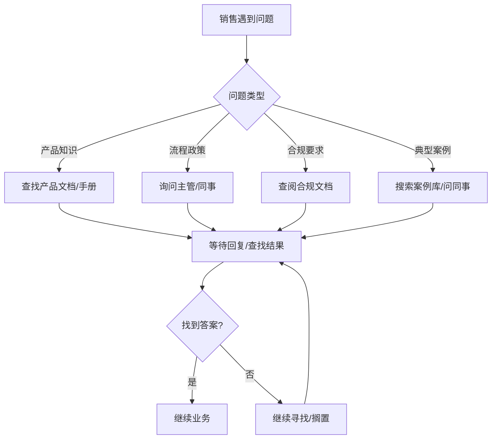
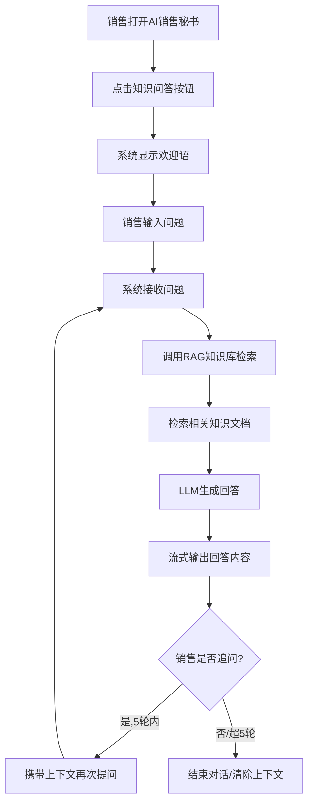

# AI销售秘书知识问答功能-需求分析

## 一、需求背景分析

### 1.1 需求来源

在AI销售秘书产品中新增知识问答能力，为销售人员提供即时的业务知识查询服务。

### 1.2 当前业务痛点

- **知识获取效率低**：销售人员在工作中遇到物流业务、产品服务、流程政策等问题时，需要手动查阅文档或询问同事，耗时长
- **知识分散**：业务知识分散在不同文档、培训资料中，缺乏统一的知识查询入口
- **新人上手慢**：新入职销售人员需要记忆大量业务知识（如网络货运概念、易达宝使用方法、司机证件要求、平台费率政策等），学习曲线陡峭
- **合规风险**：销售人员对流程政策、合规要求理解不一致，可能导致业务操作不规范

### 1.3 受影响用户/角色

- **销售人员**：主要使用者，需要快速查询业务知识
- **新入职销售**：高频使用者，依赖知识问答快速了解业务
- **销售管理者**：间接受益者，团队业务规范性和效率提升

### 1.4 不做的影响

- 销售人员继续依赖人工查询，效率低下
- 新人培训周期长，人力成本高
- 业务理解不一致可能导致合规风险和客户投诉

---

## 二、需求目标确认

### 2.1 核心目标

在AI销售秘书中新增**知识问答**功能，通过RAG（检索增强生成）知识库能力，为销售人员提供即时、准确的业务知识问答服务。

### 2.2 期望成果

| 目标项 | 衡量指标 |
|--------|----------|
| 知识查询效率提升 | 销售人员获取答案时间从平均5分钟缩短至30秒内 |
| 知识覆盖率 | 支持物流业务、产品服务、流程政策、合规风控、典型案例等核心领域 |
| 用户体验 | 支持流式输出，用户感知响应时间<3秒 |
| 对话连续性 | 支持5轮上下文记忆，支持多轮追问 |

### 2.3 目标特征

- **具体可衡量**：明确的知识领域范围、响应时间指标、记忆轮数
- **有明确价值交付**：提升销售效率，降低培训成本，减少业务差错
- **可落地执行**：基于现有RAG知识库能力，前端增加问答交互界面

---

## 三、业务流程分析

### 3.1 当前流程（现状）

销售人员遇到问题时的人工查询流程：

**现状问题**：查询路径长、依赖人工、响应时间不确定、知识分散

### 3.2 目标流程（改善后）

AI销售秘书知识问答流程：

**目标流程优势**：
- 统一入口，一键问答
- RAG知识库保证答案准确性和时效性
- 流式输出提升用户体验
- 5轮上下文记忆支持深度追问

---

## 四、功能拆解清单

### 4.1 前端功能

| 终端 | 模块 | 功能 | 功能描述 | 优先级 |
|------|------|------|----------|--------|
| AI销售秘书 | 知识问答入口 | 知识问答按钮 | 在AI销售秘书界面增加"知识问答"按钮，点击后进入问答界面 | Must |
| AI销售秘书 | 知识问答界面 | 欢迎语展示 | 点击按钮后显示固定欢迎语，包含能力说明和示例问题引导 | Must |
| AI销售秘书 | 知识问答界面 | 问题输入框 | 支持文本输入问题，支持发送按钮或回车发送 | Must |
| AI销售秘书 | 知识问答界面 | 流式回答展示 | 实时流式展示AI回答，支持markdown格式渲染 | Must |
| AI销售秘书 | 知识问答界面 | 上下文记忆 | 保持5轮对话上下文，支持多轮追问 | Must |
| AI销售秘书 | 知识问答界面 | 对话历史 | 显示当前对话的历史消息（用户问题+AI回答） | Must |
| AI销售秘书 | 知识问答界面 | 新对话按钮 | 支持手动开启新对话，清除当前上下文 | Should |
| AI销售秘书 | 知识问答界面 | 加载状态提示 | RAG检索和生成过程中显示加载动画 | Should |
| AI销售秘书 | 知识问答界面 | 错误处理 | 网络异常或知识库不可用时显示友好提示 | Should |
| AI销售秘书 | 知识问答界面 | 示例问题推荐 | 欢迎语下方展示可点击的示例问题标签 | Could |

### 4.2 后端功能

| 终端 | 模块 | 功能 | 功能描述 | 优先级 |
|------|------|------|----------|--------|
| AI销售秘书后端 | 知识问答服务 | RAG检索接口 | 接收用户问题，从知识库检索相关知识文档 | Must |
| AI销售秘书后端 | 知识问答服务 | LLM生成接口 | 基于检索结果，调用LLM生成回答，支持流式输出 | Must |
| AI销售秘书后端 | 知识问答服务 | 上下文管理 | 维护用户对话上下文，最多保持5轮历史 | Must |
| AI销售秘书后端 | 知识问答服务 | 流式输出接口 | SSE或WebSocket流式推送回答内容 | Must |
| AI销售秘书后端 | 知识库管理 | 知识库更新 | 支持知识库文档的增删改，保证知识时效性 | Should |
| AI销售秘书后端 | 知识库管理 | 知识分类 | 知识按物流业务、产品服务、流程政策、合规风控、典型案例等分类 | Should |
| AI销售秘书后端 | 数据服务 | 问答日志 | 记录问答数据，用于后续分析和知识库优化 | Could |

---

## 五、待确认事项

| 序号 | 待确认事项 | 状态 | 负责人 | 截止日期 |
|------|------------|------|--------|----------|
| 1 | AI销售秘书当前部署的终端/平台（APP/PC/小程序等） | 待确认 | - | - |
| 2 | RAG知识库是否已有可用接口？知识库内容覆盖范围？ | 待确认 | - | - |
| 3 | 5轮上下文的技术实现方案（前端维护 vs 后端维护） | 待确认 | - | - |
| 4 | 流式输出采用SSE还是WebSocket协议 | 待确认 | - | - |
| 5 | 知识库更新机制（手动维护 vs 自动同步） | 待确认 | - | - |
| 6 | 是否需要敏感问题过滤/安全审核机制 | 待确认 | - | - |
| 7 | 问答响应时间SLA要求（如P95<3秒） | 待确认 | - | - |
| 8 | 是否需要答案来源引用展示（显示参考文档） | 待确认 | - | - |
| 9 | 知识库检索失败或LLM无法回答时的降级策略 | 待确认 | - | - |

---

## 附：系统现状说明

根据当前系统架构，本需求涉及以下服务：

| 服务 | 现状 | 本需求改造 |
|------|------|------------|
| AI销售秘书前端 | 已有产品 | 新增知识问答入口和界面 |
| AI销售秘书后端 | 已有服务 | 新增RAG问答接口和上下文管理 |
| 知识库服务 | 待确认 | 需确认是否已有可用能力 |
